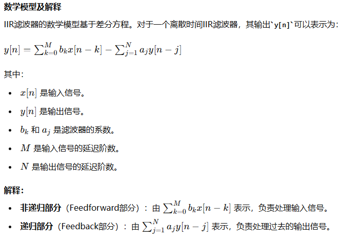
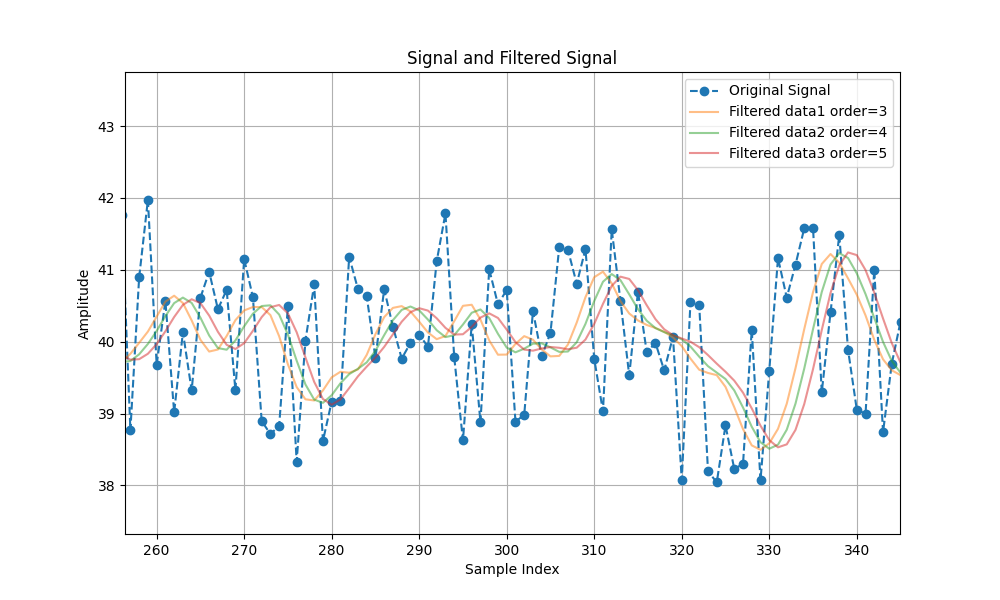
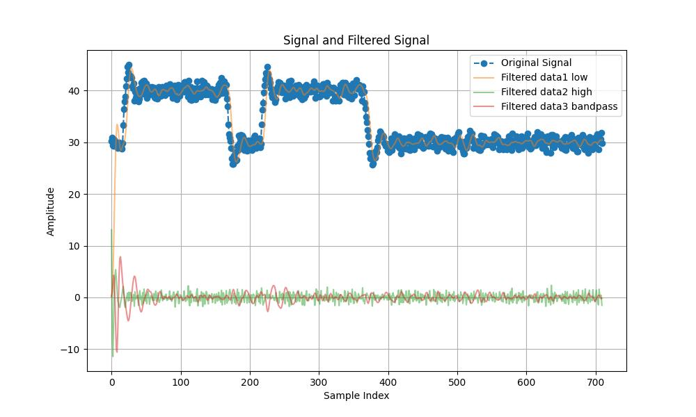

# IIR数字滤波器

## 算法方法描述

IIR（无限脉冲响应）数字滤波器是一种基于递归算法的滤波器，其输出信号不仅依赖于当前和过去的输入信号值，还依赖于过去的输出信号值。IIR滤波器因其结构和设计的特性，通常能在较低的计算复杂度下实现较好的滤波效果。它们广泛用于音频处理、图像处理、信号去噪等应用。

IIR数字滤波器的核心原理是通过递归的方式处理信号，滤波器的输出不仅依赖于当前输入和之前的输入，还依赖于之前的输出。这种递归特性使得IIR滤波器可以用较少的计算资源实现复杂的频率响应。

设计步骤

1. 选择滤波器类型：根据需求选择低通、高通、带通或带阻滤波器。
2. 选择滤波器规格：包括截止频率、滤波器阶数、通带和阻带特性。
3. 设计滤波器：使用设计方法（如巴特沃斯、切比雪夫、椭圆等）计算滤波器的系数。
4. 实现滤波器：将计算出的滤波器系数应用到差分方程中，进行实际的信号处理。

## 算法复杂度描述

IIR滤波器的时间复杂度与滤波器的阶数和输入数据的长度有关。具体来说：

+ 单次滤波计算复杂度：对于每一个输入样本，IIR滤波器需要计算与当前输入值和之前的输入值，以及之前的输出值相关的加法和乘法操作。对于一个阶数为N的滤波器，单次计算的复杂度为O(N)。
+ 总计算复杂度：对于L 个输入样本，滤波器需要进行 O(L⋅N) 次操作，其中 L 是样本数量，N 是滤波器的阶数。

## 输出结果

## 优点

1. 较小的计算开销：由于IIR滤波器只考虑过去的输出，因此计算开销较小。

2. 较高的滤波器阶数：由于IIR滤波器具有较小的计算开销，因此可以实现较高的滤波器阶数。

3. 较小的延迟：由于IIR滤波器只考虑过去的输出，因此延迟较小。

## 缺点

1. 相位非线性：IIR滤波器通常具有非线性的相位响应，这可能会导致信号失真，特别是在对相位敏感的应用中（如音频处理）。
2. 稳定性问题：由于IIR滤波器的反馈特性，设计不当可能导致滤波器不稳定，特别是在高阶滤波器的情况下。
3. 有限的线性相位选择：IIR滤波器通常无法实现线性相位响应，而FIR滤波器可以通过对称性设计实现精确的线性相位响应。
4. 复杂的设计过程：相比于FIR滤波器，IIR滤波器的设计过程更为复杂，需要仔细选择滤波器的参数以确保其性能和稳定性。

## 优化方向

1. 滤波器参数的选择：
    + 阶数 (Order)：阶数越高，滤波器的响应越尖锐，但也可能引入更多的延迟和计算复杂度。尝试不同的阶数，找到一个平衡点。
    + 截止频率 (Cutoff Frequency)：选择合适的截止频率，根据实际信号的频谱特性进行调整。
2. 滤波器类型：
    + 类型选择 (Filter Type)：根据信号的特点选择适合的滤波器类型，如低通、高通、带通或带阻滤波器。
3. 信号预处理：
    + 去噪 (Denoising)：在进行滤波之前，考虑使用其他方法去除噪声，如平均滤波或小波去噪。
    + 归一化 (Normalization)：将信号归一化到一个特定的范围，以减少滤波过程中幅度的波动。
4. 优化评估方法：
    + 更多的评估指标：除了MSE和SNR，还可以考虑其他指标，如峰值信噪比 (PSNR) 或滤波前后信号的频谱分析。

## 适用场景

1. 低通滤波：用于去除信号中的高频噪声，只保留低频成分。例如，平滑时间序列数据或去除图像中的高频噪点。
2. 高通滤波：用于去除信号中的低频成分，只保留高频成分。例如，从加速度计数据中去除重力分量。
3. 带通滤波：用于提取特定频带内的信号。例如，提取音频信号中的特定频段，或在生物医学信号处理（如脑电图EEG、心电图ECG）中提取特定频率范围的活动。
4. 带阻滤波：用于去除特定频带内的干扰信号。例如，去除电力线干扰（50/60 Hz）或其他窄带噪声。
5. 一般信号处理：适用于各种信号处理应用，包括音频处理、通信信号处理、图像处理等。

## 总结

IIR 数字滤波器在需要高效处理、实时性要求高、资源受限的应用场景中表现出色。然而，对于需要严格线性相位响应和设计相对简单的应用，FIR 滤波器可能更为适合。

## 参考文献
