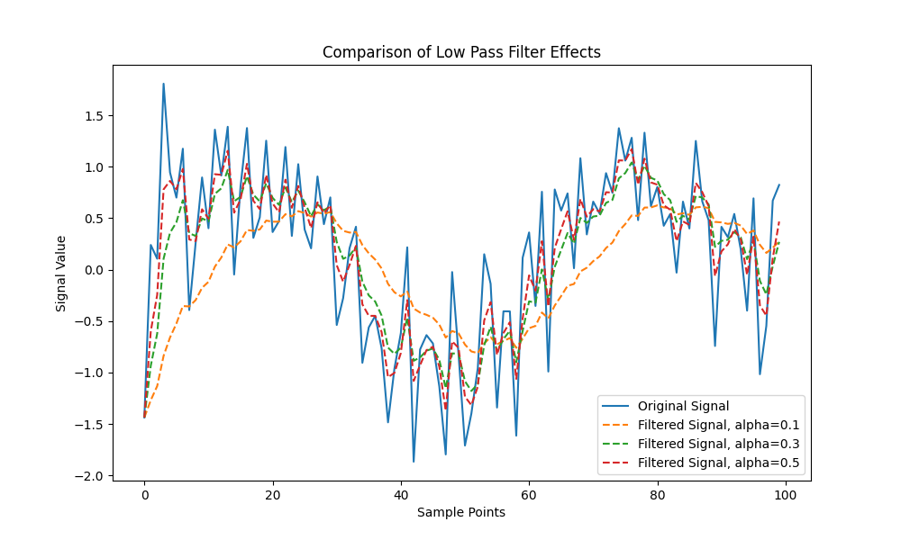
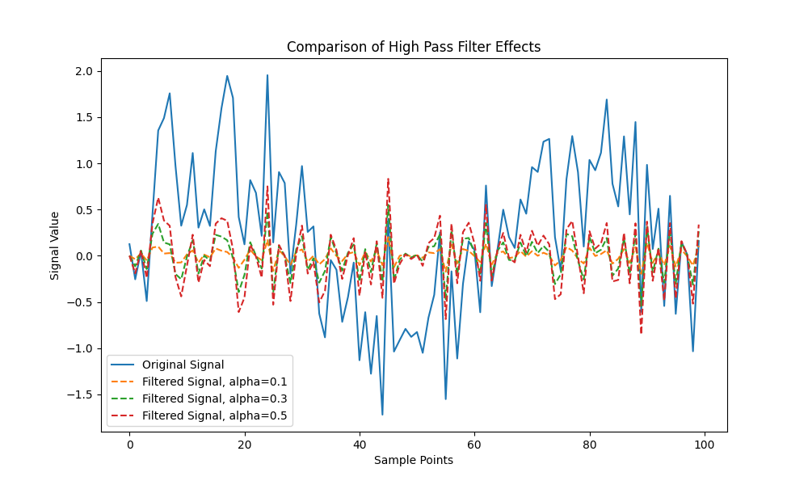
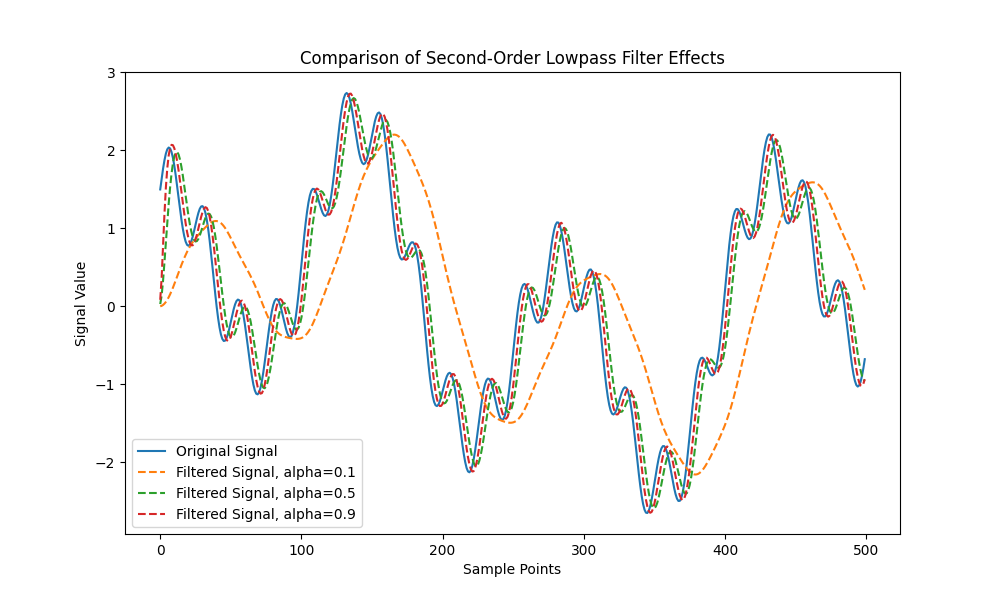

# 使用该仓库同步项目进度

1. 推荐使用 ``Markdown``来记录，最终方便展示和提交，大体框架如下
2. 推荐使用 ``ChatGPT``，帮助生成代码、解决疑问
3. 推荐但不限于的搜集文献网站：[谷歌学术](https://scholar.google.com.hk/?hl=zh-CN) [arxiv](https://arxiv.org/)
4. git常用指令网站（可供参考）： [git简易指南](https://www.bootcss.com/p/git-guide/)

# 算法研究报告格式说明

为了统一算法研究的输出内容，这里对算法的研究报告做一定的格式说明，每一个算法报告中应包含以下内容：

1. **算法简介或算法定义**；
2. **算法的已知特点、优点、缺点以及适用场景**；
3. **算法的原理和方法描述**，包括数学模型（公式）及解释以及算法复杂度的描述，主要是时间复杂度；
4. **最终输出的源数据曲线和经过算法处理后的数据曲线的对比图形**，可以是不同参数或者不同数据的多张对比图形；
5. **研究过程的参考文献**。

# 源代码实现及调优要求

源代码以单独的附件，算法实现最终输出统一为python代码（`.py`文件）或`python`项目整体压缩包给出，算法实现及调优要求如下：

1. **源代码至少包含两个函数**，一个是算法具体实现方法接口，一个是算法评估方法接口；
2. **算法实现时引用的Python框架必须注明版本号**；
3. **算法接口方法名统一用小写字母**，单词之间用下划线分割，滤波器算法使用 `filter_`开头，算法评估使用 `filter_evaluate_`开头，无论是方法命名还是变量命名，均使用有意义的单词；
4. **算法接口方法的参数**除一个必须的业务数据外，其他可调节参数应定义在接口方法中作为参数传入，算法调优的最优参数值作为默认值；
5. **重要位置添加注释**，以增加代码可读性。

# 工业控制场景下滤波器算法研究

- [使用该仓库同步项目进度](#使用该仓库同步项目进度)
- [算法研究报告格式说明](#算法研究报告格式说明)
- [源代码实现及调优要求](#源代码实现及调优要求)
- [工业控制场景下滤波器算法研究](#工业控制场景下滤波器算法研究)
  - [Requirements](#requirements)
  - [1.一阶滤波](#1一阶滤波)
    - [一阶低通滤波](#一阶低通滤波)
      - [算法方法描述](#算法方法描述)
      - [数学模型及解释](#数学模型及解释)
      - [算法复杂度描述](#算法复杂度描述)
      - [代码](#代码)
      - [输出结果](#输出结果)
      - [优点](#优点)
      - [缺点](#缺点)
      - [优化方向](#优化方向)
      - [适用场景](#适用场景)
      - [总结](#总结)
    - [一阶高通滤波](#一阶高通滤波)
      - [算法方法描述](#算法方法描述-1)
      - [数学模型解释](#数学模型解释)
      - [算法复杂度描述](#算法复杂度描述-1)
      - [代码](#代码-1)
      - [输出结果](#输出结果-1)
      - [优点](#优点-1)
      - [缺点](#缺点-1)
      - [优化方向](#优化方向-1)
      - [适用场景](#适用场景-1)
      - [总结](#总结-1)
    - [参考文献](#参考文献)
  - [2.二阶滤波](#2二阶滤波)
    - [算法方法描述](#算法方法描述-2)
      - [代码](#代码-2)
    - [输出结果](#输出结果-2)
    - [数学模型解释](#数学模型解释-1)
    - [特点](#特点)
    - [优点](#优点-2)
    - [缺点](#缺点-2)
    - [适用场景](#适用场景-2)
  - [3.FIP滤波](#3fip滤波)
  - [4.椭圆滤波](#4椭圆滤波)
  - [5.史密斯滤波器](#5史密斯滤波器)
  - [6.拉普拉斯滤波器](#6拉普拉斯滤波器)
  - [7.均值迁移滤波（Mean Shift Filter）](#7均值迁移滤波mean-shift-filter)
  - [8.算术平均滤波法](#8算术平均滤波法)
  - [9.IIR 数字滤波器](#9iir-数字滤波器)
  - [10.高斯滤波（Gaussian Filter）](#10高斯滤波gaussian-filter)
  - [11.中值滤波（Median Filter）](#11中值滤波median-filter)
  - [12.维纳滤波器](#12维纳滤波器)
  - [13.卡尔曼滤波](#13卡尔曼滤波)

## Requirements

自动生成 ``requirements.txt``:

``pip freeze > requirements.txt``

项目支持环境（commited time: 2024.7.11）

``pip install -r requirements.txt``

## 1.一阶滤波

一阶滤波器是一种基本的滤波器，用于平滑信号或减少噪声。常见的一阶滤波器包括低通滤波器和高通滤波器。以下是关于一阶滤波器算法的介绍。

### 一阶低通滤波

#### 算法方法描述

一阶低通滤波器通过对输入信号和上一次的输出信号进行加权平均来工作。该方法依赖于一个称为滤波系数的参数，该参数决定了当前输入信号与上一次输出在新输出中的相对重要性。

#### 数学模型及解释

一阶低通滤波器的数学模型可以表示为：

\[ y[n] = \alpha \cdot x[n] + (1 - \alpha) \cdot y[n-1] \]

其中：

- \(y[n]\) 是当前输出；
- \(x[n]\) 是当前输入；
- \(y[n-1]\) 是上一次的输出；
- \(\alpha\) 是滤波系数，\(0 < \alpha < 1\)。

在这个模型中，\(\alpha\) 控制着新输入信号 \(x[n]\) 对输出 \(y[n]\) 的贡献程度。较高的 \(\alpha\) 值使得滤波器对输入信号的变化更敏感，而较低的 \(\alpha\) 值使得输出更加平滑，但对信号的变化反应较慢。

#### 算法复杂度描述

- **时间复杂度**：一阶低通滤波器的时间复杂度为 \(O(1)\)。对于每个输入信号 \(x[n]\)，滤波器仅执行一次加权平均计算，计算复杂度不随输入信号的长度变化而变化。

#### 代码

[一阶低通滤波器](LowPass_Filter.py)

#### 输出结果

- 蓝线：原始数据
- 黄线：滤波系数为0.1
- 绿线：滤波系数为0.3
- 红线：滤波系数为0.5

#### 优点

1. 简单易实现：一阶滤波器结构简单，易于设计和实现，适用于对处理速度和资源消耗有限制的场合。
2. 周期干扰抑制：对于周期性的干扰信号，一阶滤波器能有效地进行抑制，提高信号的质量。
3. 平滑信号：通过调整滤波系数，一阶滤波器可以平滑输出信号，减少噪声，适用于信号预处理。

#### 缺点

1. 相位滞后：一阶滤波器会引入相位滞后，导致输出信号与输入信号之间存在延迟，影响系统的实时性。
2. 有限的频率抑制能力：不能滤除高于采样频率一半（奈奎斯特频率）的干扰信号，限制了其在高频应用中的效果。
3. 灵敏度与稳定性的权衡：滤波系数的选择需要在灵敏度和稳定性之间做出权衡，难以同时满足两者。

#### 优化方向

1. 截止频率优化：截止频率决定了滤波器的频率响应。根据应用的需要，你可以优化截止频率，使其更好地匹配所需的频率范围。选择适当的电阻和电容值可以实现所需的截止频率。
2. 时间常数调整：时间常数（τ = RC）影响滤波器的响应速度。如果需要更快的响应速度或更慢的响应速度，可以调整电阻和电容的值以更改时间常数。
3. 降低噪声：在一阶低通滤波器的输入信号中存在噪声时，你可以考虑优化滤波器以更好地抑制噪声。这可能包括使用更高阶的滤波器或添加额外的滤波阶段。
4. 增加滤波器阶数：一阶滤波器只有一个电阻和一个电容，因此其滤波能力有限。如果需要更高的滤波性能，可以考虑使用更高阶的滤波器，如二阶、三阶等。
5. 数字滤波器替代：一阶低通滤波器通常是模拟滤波器，但在数字信号处理中也可以使用数字滤波器来实现相似的功能。数字滤波器具有更大的灵活性，可以根据需要进行更复杂的优化和调整。
6. 滤波器类型选择：除了一阶低通滤波器，还有其他类型的滤波器，如巴特沃斯滤波器、切比雪夫滤波器等。选择适合特定应用的滤波器类型也是一种优化方法。
7. 硬件实现：如果需要在特定硬件平台上实现滤波器，可以考虑优化电路设计，以提高性能、降低功耗或减小尺寸。
8. 实时性能：如果需要实时滤波，考虑滤波器的计算复杂性，以确保在实时应用中满足性能要求

#### 适用场景

1. 信号预处理：在数据采集系统中，一阶滤波器常用于信号的预处理阶段，以减少噪声和平滑信号，为后续处理提供更清晰的信号。
2. 模拟信号处理：在模拟电路设计中，一阶滤波器用于抑制不需要的高频或低频成分，改善信号的质量。
3. 实时系统：在需要快速响应的实时系统中，尽管一阶滤波器会引入一定的延迟，但由于其结构简单，仍然是一种可行的选择。
4. 低成本应用：对于成本敏感的应用，一阶滤波器由于其简单性，成为一种经济有效的解决方案。

#### 总结

一阶低通滤波器是一种高效且实现简单的信号处理工具，适用于去除高频噪声和信号平滑。由于其时间复杂度为 \(O(1)\)，它特别适合于实时信号处理应用，其中计算资源可能受限。通过适当选择滤波系数 \(\alpha\)，可以根据具体应用需求调整滤波器的行为，平衡信号的平滑度和响应速度。

### 一阶高通滤波

#### 算法方法描述

一阶高通滤波器可以通过电子电路实现，也可以通过数字信号处理技术实现。在数字域中，一阶高通滤波器通常通过差分方程实现，该方程根据当前和过去的输入值以及过去的输出值来计算当前的输出值。

#### 数学模型解释

一阶高通滤波器的传递函数可以表示为： \[ H(s) = \frac{s}{s + \omega_c} \] 其中，\(s\) 是复频率变量，\(\omega_c\) 是角频率。在数字实现中，使用Z变换将上述传递函数转换为离散时间形式。

#### 算法复杂度描述

一阶高通滤波器的时间复杂度为 (O(1))，因为每个输出样本的计算仅依赖于有限数量的输入和输出样本。

#### 代码

[一阶高通滤波器](HighPass_Filter.py)

#### 输出结果

#### 优点

- 简单易实现，适用于实时信号处理。
- 计算复杂度低，适合于资源受限的系统。

#### 缺点

- 由于是一阶滤波器，其斜率较低，滤波效果不如高阶滤波器。
- 可能会引入相位偏移，影响信号的波形。

#### 优化方向

- 通过调整截止频率，可以优化滤波器的性能，以更好地适应特定应用的需求。
- 在需要更陡峭的滤波斜率时，可以考虑使用二阶或更高阶的高通滤波器。

#### 适用场景

- 信号预处理，去除低频干扰。
- 音频处理，如增强语音信号中的高频成分。
- 电子电路设计，用于信号调理和频率选择。

#### 总结

一阶高通滤波器主要用于去除信号中的低频成分，只允许高频信号通过。它在信号处理、音频处理和电子工程等领域有广泛的应用。

### 参考文献

[彻底理解一阶低通滤波（原理+代码+模型+实际车企应用例子）](https://blog.csdn.net/weixin_43780292/article/details/134351122)  
[“一阶数字低通滤波器”原理推导（含仿真和代码实现）](https://blog.csdn.net/weixin_42887190/article/details/125749509)

## 2.二阶滤波

### 算法方法描述

二阶滤波器的传输函数一般为二次多项式形式，具有两个极点和两个零点。其传输函数形式为：

\[ H(s) = \frac{b_0 + b_1 s + b_2 s^2}{a_0 + a_1 s + a_2 s^2} \]

其中，\( b_0, b_1, b_2 \) 是分子多项式的系数，\( a_0, a_1, a_2 \) 是分母多项式的系数。二阶滤波器可以实现更复杂的频率响应特性，常用于需要更高精度的滤波场合。

#### 代码

[二阶滤波器](Second_Order_Filter.py)

### 输出结果

### 数学模型解释

在数字信号处理中，二阶滤波器的差分方程可以表示为：

\[ y[n] = \frac{1}{a_0} \left( b_0 x[n] + b_1 x[n-1] + b_2 x[n-2] - a_1 y[n-1] - a_2 y[n-2] \right) \]

其中，\( x[n] \) 是输入信号，\( y[n] \) 是输出信号。

### 特点

- 二阶滤波器相比一阶滤波器具有更陡峭的频率响应，能够更精确地滤除不需要的频率成分。
- 它们的频率响应曲线在截止频率处变化更迅速。

### 优点

- 提供更好的选择性，能够更好地区分信号的频率成分。
- 在带通和带阻滤波器中，能够更有效地通过或阻止特定频带的信号。

### 缺点

- 设计和实现相对复杂，尤其是在需要特定频率响应特性的情况下。
- 数字实现时计算量较大。

### 适用场景

- 通信系统中的信号处理，如带通滤波器用于选取特定频段的信号。
- 音频处理，如均衡器中的各类滤波器。
- 图像处理中的边缘检测和增强。

## 3.FIP滤波

## 4.椭圆滤波

## 5.史密斯滤波器

## 6.拉普拉斯滤波器

## 7.均值迁移滤波（Mean Shift Filter）

## 8.算术平均滤波法

## 9.IIR 数字滤波器

## 10.高斯滤波（Gaussian Filter）

## 11.中值滤波（Median Filter）

## 12.维纳滤波器

## 13.卡尔曼滤波
