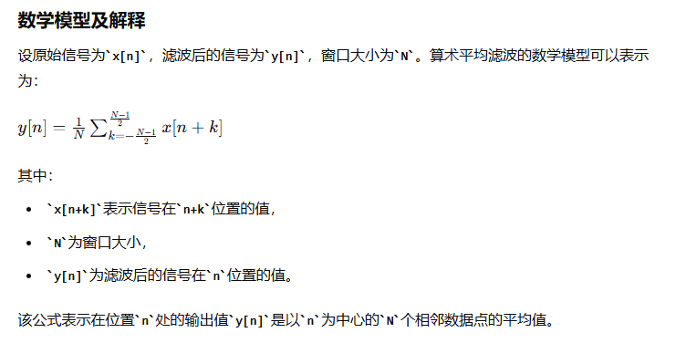
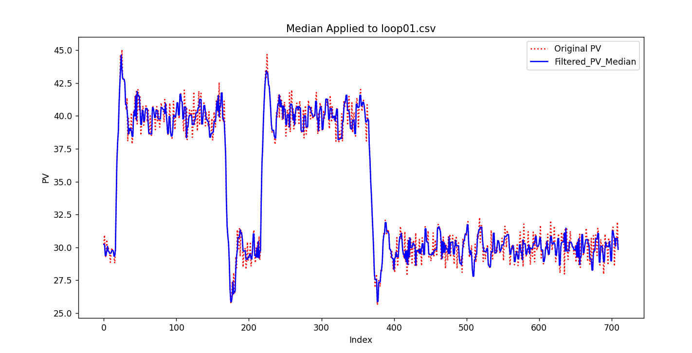

# 工业控制场景下滤波器算法研究

## 1.一阶滤波

一阶滤波器是一种基本的滤波器，用于平滑信号或减少噪声。常见的一阶滤波器包括低通滤波器和高通滤波器。以下是关于一阶滤波器算法的介绍。

### 一阶低通滤波

#### 算法方法描述

一阶低通滤波器通过对输入信号和上一次的输出信号进行加权平均来工作。该方法依赖于一个称为滤波系数的参数，该参数决定了当前输入信号与上一次输出在新输出中的相对重要性。

#### 数学模型及解释

一阶低通滤波器的数学模型可以表示为：

\[ y[n] = \alpha \cdot x[n] + (1 - \alpha) \cdot y[n-1] \]

其中：

- \(y[n]\) 是当前输出；
- \(x[n]\) 是当前输入；
- \(y[n-1]\) 是上一次的输出；
- \(\alpha\) 是滤波系数，\(0 < \alpha < 1\)。

在这个模型中，\(\alpha\) 控制着新输入信号 \(x[n]\) 对输出 \(y[n]\) 的贡献程度。较高的 \(\alpha\) 值使得滤波器对输入信号的变化更敏感，而较低的 \(\alpha\) 值使得输出更加平滑，但对信号的变化反应较慢。

#### 算法复杂度描述

- **时间复杂度**：一阶低通滤波器的时间复杂度为 \(O(1)\)。对于每个输入信号 \(x[n]\)，滤波器仅执行一次加权平均计算，计算复杂度不随输入信号的长度变化而变化。

#### 代码

[一阶低通滤波器](script/LowPass_Filter.py)

#### 输出结果

- 蓝线：原始数据
- 黄线：滤波系数为0.1
- 绿线：滤波系数为0.3
- 红线：滤波系数为0.5

#### 优点

1. 简单易实现：一阶滤波器结构简单，易于设计和实现，适用于对处理速度和资源消耗有限制的场合。
2. 周期干扰抑制：对于周期性的干扰信号，一阶滤波器能有效地进行抑制，提高信号的质量。
3. 平滑信号：通过调整滤波系数，一阶滤波器可以平滑输出信号，减少噪声，适用于信号预处理。

#### 缺点

1. 相位滞后：一阶滤波器会引入相位滞后，导致输出信号与输入信号之间存在延迟，影响系统的实时性。
2. 有限的频率抑制能力：不能滤除高于采样频率一半（奈奎斯特频率）的干扰信号，限制了其在高频应用中的效果。
3. 灵敏度与稳定性的权衡：滤波系数的选择需要在灵敏度和稳定性之间做出权衡，难以同时满足两者。

#### 优化方向

1. 截止频率优化：截止频率决定了滤波器的频率响应。根据应用的需要，你可以优化截止频率，使其更好地匹配所需的频率范围。选择适当的电阻和电容值可以实现所需的截止频率。
2. 时间常数调整：时间常数（τ = RC）影响滤波器的响应速度。如果需要更快的响应速度或更慢的响应速度，可以调整电阻和电容的值以更改时间常数。
3. 降低噪声：在一阶低通滤波器的输入信号中存在噪声时，你可以考虑优化滤波器以更好地抑制噪声。这可能包括使用更高阶的滤波器或添加额外的滤波阶段。
4. 增加滤波器阶数：一阶滤波器只有一个电阻和一个电容，因此其滤波能力有限。如果需要更高的滤波性能，可以考虑使用更高阶的滤波器，如二阶、三阶等。
5. 数字滤波器替代：一阶低通滤波器通常是模拟滤波器，但在数字信号处理中也可以使用数字滤波器来实现相似的功能。数字滤波器具有更大的灵活性，可以根据需要进行更复杂的优化和调整。
6. 滤波器类型选择：除了一阶低通滤波器，还有其他类型的滤波器，如巴特沃斯滤波器、切比雪夫滤波器等。选择适合特定应用的滤波器类型也是一种优化方法。
7. 硬件实现：如果需要在特定硬件平台上实现滤波器，可以考虑优化电路设计，以提高性能、降低功耗或减小尺寸。
8. 实时性能：如果需要实时滤波，考虑滤波器的计算复杂性，以确保在实时应用中满足性能要求

#### 适用场景

1. 信号预处理：在数据采集系统中，一阶滤波器常用于信号的预处理阶段，以减少噪声和平滑信号，为后续处理提供更清晰的信号。
2. 模拟信号处理：在模拟电路设计中，一阶滤波器用于抑制不需要的高频或低频成分，改善信号的质量。
3. 实时系统：在需要快速响应的实时系统中，尽管一阶滤波器会引入一定的延迟，但由于其结构简单，仍然是一种可行的选择。
4. 低成本应用：对于成本敏感的应用，一阶滤波器由于其简单性，成为一种经济有效的解决方案。

#### 总结

一阶低通滤波器是一种高效且实现简单的信号处理工具，适用于去除高频噪声和信号平滑。由于其时间复杂度为 \(O(1)\)，它特别适合于实时信号处理应用，其中计算资源可能受限。通过适当选择滤波系数 \(\alpha\)，可以根据具体应用需求调整滤波器的行为，平衡信号的平滑度和响应速度。

### 一阶高通滤波

#### 算法方法描述

一阶高通滤波器可以通过电子电路实现，也可以通过数字信号处理技术实现。在数字域中，一阶高通滤波器通常通过差分方程实现，该方程根据当前和过去的输入值以及过去的输出值来计算当前的输出值。

#### 数学模型解释

一阶高通滤波器的传递函数可以表示为： \[ H(s) = \frac{s}{s + \omega_c} \] 其中，\(s\) 是复频率变量，\(\omega_c\) 是角频率。在数字实现中，使用Z变换将上述传递函数转换为离散时间形式。

#### 算法复杂度描述

一阶高通滤波器的时间复杂度为 (O(1))，因为每个输出样本的计算仅依赖于有限数量的输入和输出样本。

#### 代码

[一阶高通滤波器](script/HighPass_Filter.py)

#### 输出结果

#### 优点

- 简单易实现，适用于实时信号处理。
- 计算复杂度低，适合于资源受限的系统。

#### 缺点

- 由于是一阶滤波器，其斜率较低，滤波效果不如高阶滤波器。
- 可能会引入相位偏移，影响信号的波形。

#### 优化方向

- 通过调整截止频率，可以优化滤波器的性能，以更好地适应特定应用的需求。
- 在需要更陡峭的滤波斜率时，可以考虑使用二阶或更高阶的高通滤波器。

#### 适用场景

- 信号预处理，去除低频干扰。
- 音频处理，如增强语音信号中的高频成分。
- 电子电路设计，用于信号调理和频率选择。

#### 总结

一阶高通滤波器主要用于去除信号中的低频成分，只允许高频信号通过。它在信号处理、音频处理和电子工程等领域有广泛的应用。

### 参考文献

[彻底理解一阶低通滤波（原理+代码+模型+实际车企应用例子）](https://blog.csdn.net/weixin_43780292/article/details/134351122)  
[“一阶数字低通滤波器”原理推导（含仿真和代码实现）](https://blog.csdn.net/weixin_42887190/article/details/125749509)

## 2.二阶滤波

### 算法方法描述

二阶滤波器的传输函数一般为二次多项式形式，具有两个极点和两个零点。其传输函数形式为：

\[ H(s) = \frac{b_0 + b_1 s + b_2 s^2}{a_0 + a_1 s + a_2 s^2} \]

其中，\( b_0, b_1, b_2 \) 是分子多项式的系数，\( a_0, a_1, a_2 \) 是分母多项式的系数。二阶滤波器可以实现更复杂的频率响应特性，常用于需要更高精度的滤波场合。

### 代码

[二阶滤波器](script/Second_Order_Filter.py)

### 输出结果

### 数学模型解释

在数字信号处理中，二阶滤波器的差分方程可以表示为：

\[ y[n] = \frac{1}{a_0} \left( b_0 x[n] + b_1 x[n-1] + b_2 x[n-2] - a_1 y[n-1] - a_2 y[n-2] \right) \]

其中，\( x[n] \) 是输入信号，\( y[n] \) 是输出信号。

### 特点

- 二阶滤波器相比一阶滤波器具有更陡峭的频率响应，能够更精确地滤除不需要的频率成分。
- 它们的频率响应曲线在截止频率处变化更迅速。

### 优点

- 提供更好的选择性，能够更好地区分信号的频率成分。
- 在带通和带阻滤波器中，能够更有效地通过或阻止特定频带的信号。

### 缺点

- 设计和实现相对复杂，尤其是在需要特定频率响应特性的情况下。
- 数字实现时计算量较大。

### 适用场景

- 通信系统中的信号处理，如带通滤波器用于选取特定频段的信号。
- 音频处理，如均衡器中的各类滤波器。
- 图像处理中的边缘检测和增强。

## 3.FIP滤波

### 算法简介或算法定义

FIP（Fast Iterative Shrinkage-Thresholding Algorithm, 快速迭代收缩-阈值算法）滤波是一种用于信号处理和图像去噪的算法。它属于迭代收缩-阈值算法（Iterative Shrinkage-Thresholding Algorithms, ISTA）的范畴，被广泛应用于稀疏信号和图像复原领域。FIP滤波通过迭代的方式，利用收缩和阈值操作来逐步逼近最优解。通过加速收敛的技巧，如Nesterov加速梯度法，使得其比传统的ISTA算法更快。

### 算法的特点、优点、缺点以及适用场景

#### 特点

- **快速收敛**：通过引入加速技术，收敛速度比传统的ISTA更快。
- **稀疏性**：利用L1范数正则化促进稀疏解。
- **简单性**：算法实现相对简单，易于理解和实现。

#### 优点

- **快速**：收敛速度显著快于传统的ISTA。
- **有效**：在处理稀疏信号和图像去噪问题上表现良好。
- **灵活**：可以适用于各种稀疏信号复原问题。

#### 缺点

- **对参数敏感**：需要选择合适的参数，如步长和正则化参数。
- **可能陷入局部最优**：在某些情况下可能会陷入局部最优解。

#### 适用场景

- 图像去噪
- 稀疏信号恢复
- 压缩感知
- 机器学习中的特征选择

### 算法的原理和方法描述

FIP滤波的核心思想是通过迭代更新来逐步逼近问题的最优解。它的基本步骤包括梯度下降和收缩-阈值操作。

### 数学模型

假设我们要解决以下稀疏信号恢复问题：

\[ \min_x \left( \frac{1}{2} \| Ax - b \|_2^2 + \lambda \| x \|_1 \right) \]

其中，\( A \) 是一个矩阵，\( b \) 是观测向量，\( x \) 是待求解的稀疏向量，\( \lambda \) 是正则化参数。

### FIP的迭代步骤

1. **初始化**：设初始值 \( x^0 \)，步长 \( t_0 = 1 \) 和加速参数 \( y^1 = x^0 \)。
2. **迭代**：对 \( k = 1, 2, \ldots \)，执行以下步骤：
   - 计算梯度：\[ \nabla f(y^k) = A^T (A y^k - b) \]
   - 梯度下降步：\[ x^{k} = \text{Shrinkage}(y^k - \tau \nabla f(y^k), \lambda \tau) \]
   - 更新步长：\[ t_{k+1} = \frac{1 + \sqrt{1 + 4 t_k^2}}{2} \]
   - 更新加速参数：\[ y^{k+1} = x^k + \frac{t_k - 1}{t_{k+1}} (x^k - x^{k-1}) \]

其中，Shrinkage操作定义为：

\[ \text{Shrinkage}(x, \lambda) = \text{sign}(x) \max(|x| - \lambda, 0) \]

### 代码

[FIP滤波器](script/FIP_Filter.py)

### 输出结果

### 时间复杂度

假设矩阵 \( A \) 的维度为 \( m \times n \)，FIP滤波的每次迭代主要涉及矩阵-向量乘法 \( A x \) 和 \( A^T x \)，其时间复杂度为 \( O(mn) \)。总的时间复杂度取决于迭代次数 \( k \)，一般情况下，FIP算法比ISTA需要更少的迭代次数。

### 总结

FIP滤波是一种高效的稀疏信号恢复算法，通过加速迭代技术，能够在较短时间内逼近最优解。它适用于各种稀疏信号和图像去噪问题，但需要对参数进行适当的选择和调整。

## 4.椭圆滤波

### 算法简介或算法定义

椭圆滤波器（Elliptic Filter），也称为Cauer滤波器，是一种具有极端陡峭滚降特性和可调波纹特性的滤波器。椭圆滤波器在通带和阻带中均具有等波纹特性，因其能够在指定频带内达到最陡峭的过渡而备受青睐。与巴特沃斯滤波器和切比雪夫滤波器相比，椭圆滤波器提供了最佳的频率选择性，但代价是通带和阻带中存在波纹。

### 算法的特点、优点、缺点以及适用场景

#### 特点

- **极端陡峭滚降**：在相同滤波器阶数下，椭圆滤波器提供最陡峭的频率过渡。
- **等波纹特性**：在通带和阻带中均具有等波纹特性。
- **参数化**：滤波器的设计参数（阶数、通带波纹、阻带波纹等）可以灵活调整。

#### 优点

- **高选择性**：能够在指定频率范围内实现高选择性，快速衰减。
- **灵活性**：可以通过调整参数满足不同应用需求。
- **高效**：在同样的阶数下，提供比其他类型滤波器更陡的滚降。

#### 缺点

- **波纹效应**：通带和阻带中存在波纹，可能影响某些应用场景的信号质量。
- **设计复杂**：参数选择和滤波器设计较为复杂，需要专业知识。

#### 适用场景

- **通信系统**：用于带通和带阻滤波，特别是需要高选择性的场合。
- **音频处理**：用于音频信号的噪声抑制和信号增强。
- **生物医学信号处理**：用于心电图等生物医学信号的滤波。

### 算法的原理和方法描述

椭圆滤波器通过优化通带和阻带的波纹特性，在给定阶数下实现最佳的频率选择性。其设计基于椭圆函数，因此得名椭圆滤波器。

### 数学模型

椭圆滤波器的传递函数可以表示为：

\[ H(s) = \frac{P(s)}{Q(s)} \]

其中，\( P(s) \) 和 \( Q(s) \) 分别是分子和分母多项式。这些多项式的系数是通过椭圆函数计算得到的，以满足特定的频率响应特性。

### 设计参数

- **阶数 (order)**：滤波器的阶数，决定了滤波器的复杂度和滚降特性。
- **通带波纹 (passband ripple, rp)**：通带内允许的最大波纹幅度。
- **阻带波纹 (stopband ripple, rs)**：阻带内允许的最大波纹幅度。
- **归一化截止频率 (normalized cutoff frequency, Wn)**：滤波器的截止频率，相对于奈奎斯特频率进行归一化。

### 代码

[椭圆滤波器](script/Elliptic_Filter.py)

### 输出结果

### 时间复杂度

椭圆滤波器的设计和实现涉及复杂的椭圆函数计算，其时间复杂度主要取决于滤波器的阶数和采样点数。通常情况下，椭圆滤波器设计和应用的时间复杂度可以接受，适用于实时信号处理。

### 总结

椭圆滤波器是一种高效且灵活的滤波器，在信号处理领域中广泛应用。其极端陡峭的滚降特性和可调波纹特性使其在需要高选择性和快速衰减的场合非常有用。然而，设计复杂性和通带、阻带中的波纹效应是其主要的缺点。合理选择设计参数可以最大化其优点，满足特定应用需求。

## 5.史密斯滤波器

### 算法简介或算法定义

史密斯滤波器（Smith Predictor）是一种用于控制系统中处理具有显著延迟的过程的控制算法。史密斯滤波器通过在控制回路中加入预测模型来补偿系统的延迟，从而提高系统的动态性能和稳定性。它最早由O.J.M. Smith在1957年提出，主要用于减少延迟对控制系统性能的影响。

### 算法的特点、优点、缺点以及适用场景

#### 特点

- **延迟补偿**：通过预测模型有效补偿系统中的延迟。
- **提高动态性能**：能够显著改善具有延迟的系统的动态响应。
- **模型依赖**：依赖于被控对象的精确模型。

#### 优点

- **改善稳定性**：通过补偿延迟，提高系统的稳定性。
- **提高响应速度**：能够在有延迟的情况下实现更快速的响应。
- **易于实现**：基于现有控制器易于添加预测补偿。

#### 缺点

- **模型准确性要求高**：需要精确的过程模型，否则可能导致补偿失效。
- **复杂性增加**：增加了系统设计和调试的复杂性。
- **鲁棒性有限**：对模型误差和系统变化的鲁棒性有限。

#### 适用场景

- **过程控制**：适用于具有显著延迟的工业过程控制，如化工、炼油等。
- **自动控制**：适用于自动控制系统中的延迟补偿，如温度控制、压力控制。
- **机器人控制**：适用于需要精确控制但存在信号传输延迟的机器人系统。

### 算法的原理和方法描述

史密斯滤波器的核心思想是在控制回路中加入一个预测模型，用于预测系统的未来输出，从而补偿延迟带来的影响。它的基本结构包括一个标准控制器、一个过程模型和一个预测模型。

### 数学模型

假设系统的传递函数为 \( G(s) \)，延迟为 \( e^{-Ls} \)，控制器的传递函数为 \( C(s) \)。史密斯滤波器的结构可以表示为：

\[ G_p(s) = \frac{G(s)}{1 + G(s)C(s)e^{-Ls}} \]

其中，\( G_p(s) \) 是预测模型的传递函数。

### 设计步骤

1. **确定被控对象模型**：获取被控对象的传递函数 \( G(s) \) 和延迟 \( L \)。
2. **设计标准控制器**：设计控制器 \( C(s) \)，假设系统没有延迟。
3. **构建预测模型**：基于对象模型 \( G(s) \) 和延迟 \( L \) 构建预测模型。
4. **闭环实现**：将预测模型加入到闭环控制系统中，实现延迟补偿。

### 代码

[史密斯滤波器](script/Smith_Filter.py)

### 输出结果

### 时间复杂度

史密斯滤波器的实现主要涉及传递函数的计算和控制器的设计，其时间复杂度主要取决于系统模型的复杂度和控制算法的复杂度。一般情况下，史密斯滤波器的计算开销是可以接受的，适用于实时控制系统。

### 总结

史密斯滤波器是一种用于补偿控制系统中显著延迟的有效方法。通过预测模型补偿延迟，提高系统的动态性能和稳定性。然而，其效果依赖于精确的过程模型，对模型误差和系统变化的鲁棒性有限。史密斯滤波器适用于各种具有显著延迟的过程控制和自动控制系统，是控制工程中常用的延迟补偿技术。

## 6.拉普拉斯滤波器

### 算法方法描述

拉普拉斯滤波器是一种边缘检测滤波器，基于二阶导数。其主要目的是通过计算图像或信号中的二阶导数来检测快速变化的区域（即边缘）。在一维信号处理中，拉普拉斯滤波器会突出信号中的突变点，在图像处理中，它能突出图像中的边缘。

### 算法复杂度描述

拉普拉斯滤波器的时间复杂度取决于信号或图像的大小，以及卷积操作的实现方式。在一般情况下，对于长度为 N 的一维信号，卷积操作的时间复杂度为 O(N)。

### 代码

[laplacian filter](script/laplacian/laplacian.py)

### 输出结果

### 优点

1. 边缘检测：拉普拉斯滤波器是高通滤波器，能够突出图像或信号中的快速变化区域，有助于边缘检测。
2. 简单快速：拉普拉斯滤波器的卷积操作相对简单，计算复杂度较低。

### 缺点

1. 对噪声敏感：拉普拉斯滤波器对噪声非常敏感，容易将噪声也检测为边缘。
2. 不适合平滑信号：由于拉普拉斯滤波器主要用于边缘检测，不适用于信号的平滑处理。
3. 局限性：只能检测变化和边缘，无法提供关于信号或图像结构的其他信息。

### 优化方向

1. 预处理和去噪：在应用拉普拉斯滤波器之前，先对信号进行预处理以去除噪声。

2. 结合其他滤波器：将拉普拉斯滤波器与其他滤波器（如Sobel、Canny）结合使用，以增强边缘检测效果。

3. 调整滤波器的权重：在计算拉普拉斯滤波器时，可以调整邻域像素的权重，以增强或减弱滤波效果。

4. 多尺度分析：通过不同尺度（如不同大小的窗口或不同分辨率）进行拉普拉斯滤波，以检测不同尺度下的边缘和细节。

### 适用场景

1. 图像处理：
    - 边缘检测：用于检测图像中的边缘和细节。
    - 特征提取：在图像处理中用于特征提取和形状检测。

2. 信号处理：
信号变化检测：用于检测一维信号中的突变点和不连续点。

### 总结

拉普拉斯滤波器能够准确定位信号中的变化点，计算简单高效，适合实时应用。但其对噪声敏感，容易放大信号中的高频噪声，不适用于信号平滑和降噪。

## 7.均值迁移滤波（Mean Shift Filter）

均值迁移滤波（Mean Shift Filtering）是一种非参数的聚类算法，常用于图像数据平滑和噪声去除。基本思想是通过迭代地将数据点移动到局部密度最大的区域，实现数据点的聚类和平滑。

### 算法方法描述

CSV列数据均值迁移滤波算法描述：

1. 使用pandas库读取CSV文件，提取需要进行滤波的列数据。
2. 将提取的列数据转换为适合均值迁移算法处理的格式（通常是二维数组）。
3. 均值迁移滤波：
    - 初始化均值迁移滤波器，并设置带宽参数（bandwidth），该参数决定搜索窗口的半径。
    - 对数据进行迭代处理：
      - 对于每个数据点，计算其在指定带宽范围内的邻域点。
      - 计算这些邻域点的均值。
      - 将数据点移动到该均值位置。
      - 重复上述过程，直到所有数据点的移动量小于预设的阈值或达到最大迭代次数。
    - 记录每个数据点所属的簇标签和每个簇的中心点。

### 算法复杂度描述

每个数据点需要计算其他所有数据点的距离，以确定其邻域点。这一过程的复杂度为O(n*2×d)，因为需要对每个数据点进行n次距离计算。
所以时间复杂度为：
O(T×n*2×d)
n 是数据点的数量。
T 是迭代次数。
d 是数据的维度（在处理单列数据时，d = 1）。

### 代码

[算术平均滤波](script/average/average.py)

### 输出结果

### 优点

1. 非参数性质：
    - 不需要预先假设数据的分布形式或簇的数量。
    - 只需一个带宽参数，可以自动确定簇的数量。
2. 平滑效果好：
    - 对数据进行平滑处理时，可以有效去除噪声，保留数据的主要结构。
3. 适用于多种数据类型：
    - 可以应用于一维、二维以及高维数据，广泛用于图像处理、模式识别等领域。
4. 鲁棒性强：
    - 对异常值不敏感，因为异常值通常不会形成高密度区域，不会影响簇的中心位置。

### 缺点

1. 计算复杂度高：
    - 时间复杂度较高，尤其是对于大数据集或高维数据，计算成本显著。
    - 每次迭代需要计算所有点之间的距离，邻域搜索耗时较长。
2. 依赖带宽参数：
    - 选择合适的带宽参数对算法效果至关重要，带宽过大或过小都会影响结果。
    - 需要经验或交叉验证来确定最优带宽参数。
    - 迭代次数难以预估：
3. 迭代次数取决于数据分布和带宽参数，可能需要较多迭代才能收敛。
    - 在某些情况下，收敛速度较慢。
4. 适用场景有限：
    - 对于簇形状不规则或簇内密度变化较大的数据集，效果可能不理想。
    - 对于非常高维的数据，均值迁移滤波的效果可能不如其他降维和聚类方法。
5. 内存占用高：
    - 需要存储所有点之间的距离和邻域信息，内存消耗较大，尤其是对于大规模数据集。

### 优化方向

1. 使用空间划分数据结构：如kd-tree或球树（Ball Tree），以加速邻域搜索
2. 选择合适的带宽：带宽参数对算法的收敛速度有重要影响，选择合适的带宽可以减少迭代次数。
3. 如果数据维度较高，可以先进行降维处理。

### 适用场景

1. 均值迁移滤波在图像处理和分割中具有广泛的应用
2. 均值迁移滤波适用于各种一维或多维数据的平滑和去噪。
3. 均值迁移滤波是一种强大的聚类工具，可以用于模式识别和聚类分析。
4. 在自然语言处理领域，均值迁移滤波可以用于文本聚类和主题建模。

### 总结

均值迁移滤波在处理中小规模数据集、进行噪声去除和平滑处理方面表现出色，尤其适用于图像处理和模式识别等领域。然而，其高计算复杂度和对带宽参数的敏感性限制了其在大规模数据和高维数据上的应用。针对这些问题，可以通过使用空间数据结构、降维处理和经验性带宽选择等方法进行优化。

### 参考文献

[https://blog.csdn.net/kingkee/article/details/94437333](https://blog.csdn.net/kingkee/article/details/94437333)
[https://waltpeter.github.io/open-cv-basic/image-filtering/index2.html](https://waltpeter.github.io/open-cv-basic/image-filtering/index2.html)
[https://www.jianshu.com/p/d5a473c8af48](https://www.jianshu.com/p/d5a473c8af48)

## 8.算术平均滤波法

### 算法方法描述

算术平均滤波法是一种常用的信号处理技术，主要用于去除数据中的噪声，实现信号的平滑。其基本思想是通过计算窗口内数据的算术平均值来替代中心点的值，从而达到平滑信号的效果。这种方法简单易实现，适用于处理含有随机噪声的信号。

算术平均滤波法的原理是通过对信号中的每个数据点，计算其周围一组数据点的平均值来平滑信号。具体步骤如下：

1. 确定窗口大小：选择一个窗口大小N，通常是奇数，以确保有一个明确的中心点。
2. 计算窗口内的平均值：对于信号中的每个数据点，取其前后(N-1)/2个数据点（包括自己在内）构成一个窗口，计算这个窗口内所有数据点的算术平均值。
3. 替代原始值：用计算得到的平均值替代窗口中心的数据点值。
4. 处理边界：在信号的起始和结束部分，由于窗口无法完整覆盖，可以使用较小的窗口或其他边界处理方法。

### 算法复杂度描述

假设信号长度为L，窗口大小为N，则算术平均滤波法的时间复杂度可以分为两个部分：

- 计算每个窗口的平均值：对于每个数据点，计算其前后N个数据点的平均值需要进行N次加法和一次除法。因此，总的计算量为O(L * N)。
- 边界处理：边界处理的时间复杂度通常较小，可以忽略不计。

总体来说，算术平均滤波法的时间复杂度为O(L * N)，其中L为信号长度，N为窗口大小。在实际应用中，窗口大小N通常远小于信号长度L，因此时间复杂度可以简化为O(L)。

### 代码

[算术平均滤波](script/airthmetic/arithmetic.py)

### 输出结果

### 优点

1. 简单易实现：
算术平均滤波法的计算和实现非常简单，不需要复杂的数学运算和编程技巧，适合初学者和快速实现。

2. 计算效率高：
算术平均滤波法的时间复杂度为O(L * N)，其中L是信号长度，N是窗口大小。在实际应用中，窗口大小通常较小，因此计算效率较高。

3. 平滑效果明显：
对于含有高频随机噪声的信号，算术平均滤波法能够有效地平滑信号，减少噪声影响。

### 缺点

1. 边界效应：
在信号的边界处，由于窗口无法完整覆盖，算术平均滤波法可能会导致边界效应，影响滤波效果。

2. 信号细节损失：
算术平均滤波法对信号的所有部分一视同仁，因此在去除噪声的同时，也可能会平滑掉信号中的一些细节和突变。

3. 不适用于非高斯噪声：
算术平均滤波法假设噪声为高斯白噪声，对于非高斯噪声的处理效果较差，例如尖锐的脉冲噪声。

4. 窗口大小选择困难：
窗口大小的选择是一个权衡过程，过大会导致信号过度平滑，过小则无法有效去除噪声。

### 优化方向

1. 调整窗口大小：
    - 窗口大小是影响滤波效果的关键参数。较大的窗口会平滑更多的噪声，但可能会丢失信号细节；较小的窗口则可能无法有效去除噪声。可以尝试不同的窗口大小来找到最佳值。
1. 加权平均滤波：
    - 与简单的算术平均滤波不同，加权平均滤波会赋予离中心更近的数据点更高的权重。这可以在平滑信号的同时保留更多的信号细节。
1. 多次滤波：
    - 过对信号进行多次滤波，可以进一步平滑信号。然而，过多的滤波可能会导致信号失真，因此需要权衡。
1. 边界处理：
    - 算术平均滤波在处理边界数据点时，通常会使用较小的窗口。这可能会导致边界效应。可以通过不同的边界处理策略（如镜像填充、循环填充等）来改进边界滤波效果。
1. 非线性滤波器：
    - 非线性滤波器（如中值滤波器）在处理含有尖锐噪声的信号时表现更好。可以考虑结合不同类型的滤波器来改善滤波效果。

### 适用场景

1. 随机噪声平滑：
算术平均滤波法适用于含有随机高斯噪声的信号，可以有效地平滑信号，减少噪声影响。

2. 传感器数据处理：
传感器数据通常包含随机噪声，算术平均滤波法可以用于传感器数据的平滑处理，提高数据的准确性和稳定性。

3. 图像处理：
在图像处理领域，算术平均滤波法可以用于图像的平滑处理，减少图像中的高频噪声。

4. 预处理步骤：
在进行复杂信号处理之前，算术平均滤波法可以作为一种预处理步骤，初步平滑信号，减少噪声影响。

### 总结

算术平均滤波法是一种简单而常用的信号滤波方法。它通过连续取 N 个采样值进行算术平均运算，可以有效地平滑信号并减小噪声的影响。算术平均滤波法适用于对一般具有随机干扰的信号进行滤波，尤其适用于具有平均值且在一定范围内波动的信号。

特别需要注意的是，算术平均滤波法相对较简单，并且对快速变化和突变信号的响应较为迟缓。因此，在一些需要快速响应信号变化的应用中，可能不适合使用算术平均滤波法。

### 参考文献

[算术平均滤波法](https://blog.csdn.net/weixin_47225948/article/details/133125540)
[模拟量处理方式介绍（2）算术平均滤波法](https://jzgkchina.com/node/1869)

## 9.IIR 数字滤波器

### 算法方法描述

IIR（无限脉冲响应）数字滤波器是一种基于递归算法的滤波器，其输出信号不仅依赖于当前和过去的输入信号值，还依赖于过去的输出信号值。IIR滤波器因其结构和设计的特性，通常能在较低的计算复杂度下实现较好的滤波效果。它们广泛用于音频处理、图像处理、信号去噪等应用。

IIR数字滤波器的核心原理是通过递归的方式处理信号，滤波器的输出不仅依赖于当前输入和之前的输入，还依赖于之前的输出。这种递归特性使得IIR滤波器可以用较少的计算资源实现复杂的频率响应。

设计步骤

1. 选择滤波器类型：根据需求选择低通、高通、带通或带阻滤波器。
2. 选择滤波器规格：包括截止频率、滤波器阶数、通带和阻带特性。
3. 设计滤波器：使用设计方法（如巴特沃斯、切比雪夫、椭圆等）计算滤波器的系数。
4. 实现滤波器：将计算出的滤波器系数应用到差分方程中，进行实际的信号处理。

### 算法复杂度描述

IIR滤波器的时间复杂度与滤波器的阶数和输入数据的长度有关。具体来说：

- 单次滤波计算复杂度：对于每一个输入样本，IIR滤波器需要计算与当前输入值和之前的输入值，以及之前的输出值相关的加法和乘法操作。对于一个阶数为N的滤波器，单次计算的复杂度为O(N)。
- 总计算复杂度：对于L 个输入样本，滤波器需要进行 O(L⋅N) 次操作，其中 L 是样本数量，N 是滤波器的阶数。

### 代码

[IIR滤波器](script/IIR/IIR.py)

### 输出结果

### 优点

1. 较小的计算开销：由于IIR滤波器只考虑过去的输出，因此计算开销较小。

2. 较高的滤波器阶数：由于IIR滤波器具有较小的计算开销，因此可以实现较高的滤波器阶数。

3. 较小的延迟：由于IIR滤波器只考虑过去的输出，因此延迟较小。

### 缺点

1. 相位非线性：IIR滤波器通常具有非线性的相位响应，这可能会导致信号失真，特别是在对相位敏感的应用中（如音频处理）。
2. 稳定性问题：由于IIR滤波器的反馈特性，设计不当可能导致滤波器不稳定，特别是在高阶滤波器的情况下。
3. 有限的线性相位选择：IIR滤波器通常无法实现线性相位响应，而FIR滤波器可以通过对称性设计实现精确的线性相位响应。
4. 复杂的设计过程：相比于FIR滤波器，IIR滤波器的设计过程更为复杂，需要仔细选择滤波器的参数以确保其性能和稳定性。

### 优化方向

1. 滤波器参数的选择：
    - 阶数 (Order)：阶数越高，滤波器的响应越尖锐，但也可能引入更多的延迟和计算复杂度。尝试不同的阶数，找到一个平衡点。
    - 截止频率 (Cutoff Frequency)：选择合适的截止频率，根据实际信号的频谱特性进行调整。
2. 滤波器类型：
    - 类型选择 (Filter Type)：根据信号的特点选择适合的滤波器类型，如低通、高通、带通或带阻滤波器。
3. 信号预处理：
    - 去噪 (Denoising)：在进行滤波之前，考虑使用其他方法去除噪声，如平均滤波或小波去噪。
    - 归一化 (Normalization)：将信号归一化到一个特定的范围，以减少滤波过程中幅度的波动。
4. 优化评估方法：
    - 更多的评估指标：除了MSE和SNR，还可以考虑其他指标，如峰值信噪比 (PSNR) 或滤波前后信号的频谱分析。

### 适用场景

1. 低通滤波：用于去除信号中的高频噪声，只保留低频成分。例如，平滑时间序列数据或去除图像中的高频噪点。
2. 高通滤波：用于去除信号中的低频成分，只保留高频成分。例如，从加速度计数据中去除重力分量。
3. 带通滤波：用于提取特定频带内的信号。例如，提取音频信号中的特定频段，或在生物医学信号处理（如脑电图EEG、心电图ECG）中提取特定频率范围的活动。
4. 带阻滤波：用于去除特定频带内的干扰信号。例如，去除电力线干扰（50/60 Hz）或其他窄带噪声。
5. 一般信号处理：适用于各种信号处理应用，包括音频处理、通信信号处理、图像处理等。

### 总结

IIR 数字滤波器在需要高效处理、实时性要求高、资源受限的应用场景中表现出色。然而，对于需要严格线性相位响应和设计相对简单的应用，FIR 滤波器可能更为适合。

## 10.高斯滤波（Gaussian Filter）

### 算法方法描述

高斯滤波器是一种线性平滑滤波器，基于高斯函数的形状进行加权平均。其核心思想是通过高斯分布对信号中的每个点进行加权平均，权重由点到中心的距离和标准差（σ）决定。

1. 高斯核的计算：
    - 根据给定的标准差 σ，计算高斯核。
    - 核大小通常选择为 2k+1，即 2×3σ+1。
2. 边缘处理：
处理信号边缘时，可以使用填充（如镜像填充、零填充）策略来避免边缘效应。
3. 卷积运算：
使用高斯核对信号进行卷积运算，得到平滑后的信号。

### 算法复杂度描述

假设信号长度为 N，高斯核大小为 K，一维高斯滤波器的时间复杂度为 O(NK)。

### 代码

[gaussian_filter](script/gaussian/gaussian.py)

### 输出结果

### 优点

1. 平滑效果好：高斯滤波器对信号或图像进行平滑处理，能够有效减少高频噪声。
2. 无振铃效应：高斯滤波器是无振铃滤波器，不会在信号的边缘产生振铃效应，这对于一些对边缘敏感的应用场景非常有用。
3. 数学性质良好：高斯函数在时域和频域都是良好定义的，其卷积运算具有平滑和低通滤波效果，且性质容易分析。
4. 可参数化调节：通过调整标准差 σ，可以灵活控制滤波器的平滑程度。

### 缺点

1. 模糊边缘：高斯滤波器会平滑整个信号或图像，包括边缘部分，可能导致边缘细节丢失和模糊化。
2. 计算复杂度较高：虽然一维高斯滤波的计算复杂度较低，但对于高维数据（如图像），其计算复杂度较高。
3. 无法保留细节：高斯滤波器是低通滤波器，无法同时保留高频细节和去除噪声。

### 优化方向

1. 选择合适的标准差 (sigma)：
不同的标准差会影响平滑效果和信号保留程度。较小的标准差会保留更多的原始信号特征，但可能不能很好地去除噪声；较大的标准差会更好地去除噪声，但可能会导致信号模糊。因此，需要根据实际应用选择合适的标准差。
1. 多尺度滤波：
使用多个不同标准差的高斯滤波器对信号进行多尺度滤波，然后结合不同尺度的滤波结果，可以更好地平衡去噪和信号保留。
1. 边缘处理：
在边缘处理时，可以使用不同的策略（如填充、裁剪等）来减少边缘效应的影响。
1. 快速算法：
对于大数据集，可以使用快速算法来提高计算效率。例如，使用快速傅里叶变换（FFT）来加速高斯滤波。

### 适用场景

1. 图像处理：
    - 去噪：用于去除图像中的高频噪声。
    - 预处理：在进一步的图像处理（如边缘检测、特征提取）之前进行平滑处理。
2. 信号处理：
    - 信号平滑：对一维信号进行平滑处理，去除高频噪声。
    - 特征提取：在信号分析中，用于平滑信号以提取主要趋势。
3. 计算机视觉：
    - 图像金字塔：用于生成图像金字塔的高斯平滑层次。
    - 边缘检测：作为Canny边缘检测等算法的预处理步骤。
4. 医学图像处理：
    - 去噪：在CT、MRI等医学成像中，用于去除噪声，提升图像质量。
    - 图像增强：用于增强图像对比度和细节。

## 11.中值滤波（Median Filter）

中值滤波（Median Filter）是一种非线性滤波方法，广泛应用于信号处理和图像处理领域。其主要思想是用窗口内所有像素的中值替换窗口中心的像素值，从而有效去除噪声，同时保留图像的边缘信息。

### 算法简介或算法定义

中值滤波器的基本原理是在给定的窗口内对像素值进行排序，并用中间值（即中位数）来替代窗口中心的像素值。这种方法对于去除椒盐噪声非常有效，同时能够保持图像的边缘特征。

### 算法的已知特点、优点、缺点以及适用场景

#### 特点

- 非线性处理
  - 中值滤波器是一种非线性滤波器，这与大多数线性滤波器（如均值滤波）不同。它通过将窗口内的像素值排序并选择中间值来进行滤波，这种处理方式能够有效地去除尖锐的噪声（如盐和胡椒噪声）而不会显著改变图像的结构。
- 噪声抑制能力强
  - 中值滤波特别有效于去除脉冲噪声（盐和胡椒噪声）。它通过替换窗口中心像素的值为窗口内所有像素的中值，能够有效去除那些明显偏离窗口内其他像素的异常值，从而抑制噪声。
- 保持图像边缘细节
  - 与均值滤波器不同，中值滤波器在去噪的同时能够更好地保护图像的边缘和细节。由于它使用中值而非平均值，能够保持边缘和纹理信息，而不会导致边缘模糊。
- 不受信号分布影响
  - 中值滤波器对信号分布不敏感，不需要假设噪声的特定分布模式。这使得中值滤波器在各种不同的噪声情况下都能够有效工作。

#### 优点

- 有效去除尖锐噪声：中值滤波器非常适合去除信号中的尖锐噪声（如突发的异常值），例如传感器数据中的瞬时尖峰或掉落值。
- 保留信号趋势：与均值滤波器相比，中值滤波器能更好地保留信号的趋势和结构，因为它避免了对异常值的平均化影响。
- 鲁棒性强：中值滤波对噪声的分布形式具有较强的鲁棒性，特别是对离群值和极端值有很好的处理能力。对于数据中偶发的异常点，中值滤波能够有效地去除这些异常点，而不改变整体信号的趋势。
- 简单实现：中值滤波算法简单易懂，实施起来相对容易，不需要复杂的计算。

#### 缺点

- 计算复杂度高：在大数据集或长时间序列上应用中值滤波时，计算每个窗口的中值需要对窗口内数据进行排序，这可能导致较高的计算复杂度（特别是对于较大的窗口）。
- 无法去除高频噪声：中值滤波主要对离群值和尖锐噪声有效，但对高频噪声（如高斯噪声）的处理效果有限。对于频率较高的噪声类型，可能需要其他滤波技术（如高斯滤波）。
- 边缘效应：在信号的边缘或短暂变化的区域，中值滤波可能会引入一些延迟或改变信号的特性，特别是在数据窗口的两端。
- 窗口大小固定：中值滤波的窗口大小固定，可能导致在某些情况下，滤波效果不够理想。例如，在信号变化非常快的区域，较大的窗口可能导致平滑过度，较小的窗口则可能无法有效去除噪声。

#### 适用场景

- 传感器数据处理
  - 噪声抑制：在传感器数据中，尤其是在环境噪声较大的情况下，中值滤波器能有效去除尖锐的瞬时噪声（如突发的异常值），提高数据的可靠性。
  - 数据清洗：对于从传感器获得的数据，中值滤波器可以用来清洗数据，去除离群点，保留信号的真实特征。
- 医学信号处理
  - 心电图（ECG）信号：在心电图信号中，中值滤波器可以有效去除运动伪影和电气干扰，同时保留心电信号的波形特征。
  - 脑电图（EEG）信号：用于去除脑电图中的瞬时干扰（如眼动伪影），帮助提高信号的质量和分析准确性。
- 图像处理

#### 优化方向

- 自适应窗口：根据数据的局部特性动态调整窗口大小。例如，在噪声较大的区域使用较大的窗口，而在信号变化较快的区域使用较小的窗口。这可以通过计算局部噪声水平来实现。
- 加速计算：使用高效的数据结构和算法来加速中值计算，例如利用快速排序算法、堆或平衡树等数据结构，减少排序操作的时间复杂度。
- 多尺度滤波：应用多尺度分析方法，在不同的尺度上对数据进行中值滤波，以平衡噪声去除和信号保留。例如，先在较大的窗口中进行初步滤波，再在较小的窗口中进行细节修复。
- 结合其他滤波器：将中值滤波器与其他滤波技术（如高斯滤波器、卡尔曼滤波器）结合使用。通过先使用其他滤波器去除高频噪声，再应用中值滤波器处理离群值，达到更好的综合效果。
- 处理信号边缘：对于信号的边缘或短暂变化区域，可以使用边缘处理技术，如镜像扩展或重复边界处理，来减少边缘效应对滤波效果的影响。

### 算法方法

1. **定义滑动窗口**：选择一个固定大小的窗口（如 \(3 \times 3\) 或 \(5 \times 5\)），在数据或信号上滑动。

2. **提取窗口内数据**：在窗口中心位置的每个位置，提取窗口内的所有数据点（或信号值）。

3. **计算中值**：
   - 对窗口内的数据进行排序。
   - 选择排序后数据的中位数作为当前窗口中心位置的新值。

4. **更新数据**：将中值替换原数据中窗口中心位置的值。

5. **滑动窗口**：将窗口滑动到数据中的下一个位置，重复步骤 2 到 4，直到整个数据或信号处理完成。

### 数学模型（公式）

设原始数据为 \( x \)，窗口大小为 \( k \times k \)，其中 \( k \) 为奇数。假设当前窗口的中心位置为 \( (i, j) \)，窗口内数据为 \( \{x_{i', j'}\} \)，其中 \( i' \) 和 \( j' \) 为窗口内的相对位置。则滤波后的数据为：

\[ y_{i, j} = \text{median}(\{x_{i', j'}\}) \]

其中，\(\text{median}(\{x_{i', j'}\})\) 表示窗口内数据的中位数。

### 代码

[中值滤波](script/Median/Median_filter.py)

### 算法复杂度描述

- **时间复杂度**：中值滤波的时间复杂度主要由窗口内数据的排序操作决定。对于一个 \(k \times k\) 的窗口，排序的时间复杂度为 \(O(k^2 \log k^2)\)，而在处理整个数据时需要对每个位置进行操作。因此，总的时间复杂度为 \(O(N \cdot k^2 \log k^2)\)，其中 \(N\) 是数据的总长度。

- **空间复杂度**：中值滤波的空间复杂度主要取决于窗口的大小和临时存储排序结果的空间。总体空间复杂度为 \(O(k^2)\)。

### 输出结果

## 12.维纳滤波器

维纳滤波器（Wiener Filter）是一种用于信号处理的线性滤波器，旨在去除噪声并尽可能保留信号的有用成分。其核心思想是基于最小均方误差（MMSE）准则，通过利用信号和噪声的统计特性来优化信号恢复。维纳滤波器在一维（如时间序列）和二维（如图像处理）领域都广泛应用。

### 原理和方法描述

维纳滤波器的基本目标是找到一个滤波器 \( H(f) \)，使得经过滤波器处理后的输出信号尽可能接近原始信号。在频域中，维纳滤波器的传递函数 \( H(f) \) 可以表示为：

\[ H(f) = \frac{S_{XX}(f)}{S_{XX}(f) + S_{NN}(f)} \]

其中：

- \( S_{XX}(f) \) 是信号的功率谱密度。
- \( S_{NN}(f) \) 是噪声的功率谱密度。

滤波器的输出 \( Y(f) \) 是输入信号 \( X(f) \) 和滤波器 \( H(f) \) 的乘积：

\[ Y(f) = H(f) \cdot X(f) \]

维纳滤波器的设计依赖于对信号和噪声统计特性的了解，即信号和噪声的功率谱密度。

### 算法的已知特点、优点、缺点以及适用场景

#### 特点

- 最优性
  - 维纳滤波器基于最小均方误差准则提供最优估计，可以有效地去除高斯噪声。它在统计意义上提供了最优的信号恢复效果。
- 噪声抑制
  - 通过利用信号和噪声的统计特性，维纳滤波器能够有效地抑制噪声，特别是当噪声是高斯分布时。
- 保留信号细节
  - 维纳滤波器能够在噪声去除的同时，尽量保留信号的细节部分，这是因为它是通过频域的增益函数来调节的。

#### 优点

- **最佳滤波**：维纳滤波器在最小均方误差准则下是最佳的，能够在已知信号和噪声统计特性的前提下达到最佳噪声抑制效果。
- **平滑处理**：能够有效平滑信号，去除高频噪声成分。
- **频域操作**：可在频域中操作，适合处理频域特性已知的信号。

#### 缺点

- **对统计特性依赖强**：需要信号和噪声的统计特性（如功率谱密度）的先验知识，实际应用中获取这些信息可能困难。
- **不适合非平稳噪声**：对于非平稳噪声效果不佳，因为非平稳噪声的统计特性随时间变化。
- **复杂性**：计算复杂度较高，尤其是在高维数据（如图像）处理中。

#### 适用场景

维纳滤波器适用于以下场景：

- **信号恢复**：在存在已知特性噪声的情况下，从噪声信号中恢复原始信号。
- **图像去噪**：去除图像中的高斯噪声，保留图像细节。
- **音频处理**：在音频处理中去除背景噪声，如语音信号中的噪声抑制。

### 优化方向

- **估计统计特性**：提高信号和噪声统计特性的估计精度，能显著提升滤波效果。
- **自适应滤波**：在处理非平稳噪声时，使用自适应维纳滤波器，能动态调整滤波器参数以适应噪声变化。
- **计算效率优化**：在实现上使用快速算法，如快速傅里叶变换（FFT）来提高计算效率。

### 代码

[维纳滤波](script/Wiener/Wiener_filter.py)

### 输出结果

## 13.卡尔曼滤波

卡尔曼滤波（Kalman Filter）是一种用于线性动态系统的递归滤波算法，广泛应用于估计系统状态和噪声滤除。其主要目的是在噪声存在的情况下，通过对系统的动态模型进行估计，获得最佳的状态估计值。

### 算法简介或算法定义

卡尔曼滤波是一种基于线性系统和高斯噪声假设的递归算法。它使用状态空间模型描述系统的动态过程，并通过预测和更新步骤来递归地估计系统的状态。该算法由两部分组成：

1. **预测步骤**：使用当前状态和系统模型预测下一时刻的状态和协方差矩阵。
2. **更新步骤**：结合观测数据和预测结果，更新状态估计和协方差矩阵。

### 算法的已知特点、优点、缺点以及适用场景

#### 特点

- **线性系统假设**：
  - 卡尔曼滤波假设系统动态模型是线性的，并且系统噪声和观测噪声是高斯分布的。这使得卡尔曼滤波在处理线性系统时非常有效，但对非线性系统可能需要扩展（如扩展卡尔曼滤波或无迹卡尔曼滤波）。

- **递归处理**：
  - 卡尔曼滤波是一种递归算法，不需要存储全部历史数据。每一步只需要当前状态估计和最新观测数据即可进行更新，这使得卡尔曼滤波适用于实时应用。

- **最优估计**：
  - 在高斯噪声假设下，卡尔曼滤波能够提供最小均方误差的估计。它通过最小化估计误差的协方差来优化状态估计。

- **状态空间模型**：
  - 卡尔曼滤波使用状态空间模型描述系统的状态转移和观测过程。系统状态通过线性模型转移，并且观测值是状态的线性函数加上噪声。

#### 优点

- **高效处理**：
  - 卡尔曼滤波不需要存储历史数据，通过递归计算实时更新状态估计，使得计算量较小。

- **最优估计**：
  - 在高斯噪声假设下，卡尔曼滤波能够提供最优的线性估计，最小化估计误差的方差。

- **实时性**：
  - 由于算法的递归特性，卡尔曼滤波适用于实时系统，可以在线处理数据并更新估计值。

- **灵活性**：
  - 可以与其他滤波技术结合使用，例如将卡尔曼滤波与非线性滤波器结合，处理复杂的系统。

#### 缺点

- **线性假设**：
  - 卡尔曼滤波假设系统和观测过程是线性的，对非线性系统效果较差。需要扩展卡尔曼滤波或无迹卡尔曼滤波等方法处理非线性问题。

- **高斯噪声假设**：
  - 卡尔曼滤波假设噪声是高斯分布的，对于其他噪声分布可能效果不佳。

- **模型依赖**：
  - 卡尔曼滤波的性能依赖于系统模型的准确性。如果模型不准确，估计效果可能不理想。

- **计算复杂度**：
  - 在高维系统中，矩阵运算可能导致较高的计算复杂度，尤其是在状态和观测维度较大时。

#### 适用场景

- **导航和定位**：
  - 在卫星导航、GPS定位等应用中，卡尔曼滤波可以用来估计和预测物体的位置和速度，同时抑制噪声对观测结果的影响。

- **自动控制**：
  - 在自动驾驶、飞行控制等系统中，卡尔曼滤波能够提供准确的状态估计，支持控制系统的决策和调整。

- **信号处理**：
  - 在信号处理领域，卡尔曼滤波可以用来去除噪声和滤波信号，提高信号的质量和可用性。

- **金融数据分析**：
  - 在金融市场分析中，卡尔曼滤波可以用于预测和跟踪市场价格的动态变化，提高投资决策的准确性。

### 算法方法

1. **初始化**：
   - 初始化系统状态估计 \( \hat{x}_0 \) 和协方差矩阵 \( P_0 \)。

2. **预测步骤**：
   - 预测下一时刻的状态 \( \hat{x}_{k|k-1} \) 和协方差矩阵 \( P*{k|k-1} \)：
     \[
     \hat{x}*{k|k-1} = A \hat{x}*{k-1} + B u_k
     \]
     \[
     P*{k|k-1} = A P*{k-1} A^T + Q
     \]
     其中，\( A \) 是状态转移矩阵，\( B \) 是控制输入矩阵，\( u_k \) 是控制输入，\( Q \) 是过程噪声协方差矩阵。

3. **更新步骤**：
   - 计算卡尔曼增益 \( K_k \)：
     \[
     K_k = P_{k|k-1} H^T (H P_{k|k-1} H^T + R)^{-1}
     \]
     其中，\( H \) 是观测矩阵，\( R \) 是观测噪声协方差矩阵。

   - 更新状态估计 \( \hat{x}*k \) 和协方差矩阵 \( P_k \)：
     \[
     \hat{x}*k = \hat{x}*{k|k-1} + K_k (z_k - H \hat{x}*{k|k-1})
     \]
     \[
     P_k = (I - K_k H) P_{k|k-1}
     \]
     其中，\( z_k \) 是观测值，\( I \) 是单位矩阵。

### 数学模型（公式）

设原始数据为 \( x \)，状态转移矩阵为 \( A \)，观测矩阵为 \( H \)，过程噪声协方差矩阵为 \( Q \)，观测噪声协方差矩阵为 \( R \)。预测和更新步骤可以表示为：

1. **预测步骤**：
   \[
   \hat{x}*{k|k-1} = A \hat{x}*{k-1} + B u_k
   \]
   \[
   P_{k|k-1} = A P_{k-1} A^T + Q
   \]

2. **更新步骤**：
   \[
   K_k = P_{k|k-1} H^T (H P_{k|k-1} H^T + R)^{-1}
   \]
   \[
   \hat{x}*k = \hat{x}*{k|k-1} + K_k (z_k - H \hat{x}*{k|k-1})
   \]
   \[
   P_k = (I - K_k H) P_{k|k-1}
   \]

### 算法复杂度描述

- **时间复杂度**：
  - 卡尔曼滤波的时间复杂度主要由矩阵运算决定，尤其是矩阵乘法和逆操作。在每个时间步，状态和观测矩阵的乘法和逆操作的复杂度为 \(O(n^3)\)，其中 \(n\) 是状态或观测的维度。总体时间复杂度为 \(O(K \cdot n^3)\)，其中 \(K\) 是时间步数。

- **空间复杂度**：
  - 卡尔曼滤波的空间复杂度主要取决于状态和协方差矩阵的大小。总体空间复杂度为 \(O(n^2)\)，其中 \(n\) 是状态或观测的维度。

### 代码

[卡尔曼滤波](script/Kalman/Kalman_filter.py)

### 输出结果

## 14. 切比雪夫滤波器（Chebyshev Filter）

切比雪夫滤波器是一种用于信号处理的数字滤波器，因其在频率响应上的锐利过渡而著称。它基于切比雪夫多项式设计，能够在满足设计要求的同时最小化滤波器的阶数。根据响应特性不同，切比雪夫滤波器可以分为I型和II型。

### 算法简介或算法定义

切比雪夫滤波器通过切比雪夫多项式来设计其传递函数，以达到在较低阶数下实现陡峭频率过渡的目的。I型切比雪夫滤波器在通带内具有等波纹（ripple），而II型在阻带内具有等波纹。该滤波器适用于需要严格频率分离的应用场景。

### 算法的已知特点、优点、缺点以及适用场景

#### 特点

- **锐利的频率过渡**：
  - 切比雪夫滤波器在通带和阻带之间的过渡带非常陡峭，使得它在频率分离任务中表现优异。

- **等波纹响应**：
  - I型滤波器在通带内具有等波纹，而II型滤波器在阻带内具有等波纹，这使得它们在不同应用中表现出独特的优势。

- **非线性相位响应**：
  - 切比雪夫滤波器的设计导致其相位响应通常是非线性的，这可能在某些应用中引入相位失真。

#### 优点

- **更低的阶数**：相比其他滤波器，切比雪夫滤波器可以在较低阶数下实现陡峭的频率过渡。
- **灵活的设计**：通过调节波纹大小，可以灵活地设计滤波器以满足不同应用的需求。
- **高效频率分离**：适用于需要在信号处理中严格区分不同频率成分的场景，如通信系统中的信号过滤。

#### 缺点

- **相位失真**：由于非线性相位响应，切比雪夫滤波器可能在相位敏感的应用中引入失真。
- **波纹引入**：通带或阻带内的波纹可能导致信号幅值不稳定，尤其在应用于需要精确幅值保持的场合时。

#### 适用场景

- **通信系统**：
  - 在通信系统中，切比雪夫滤波器用于频率选择性任务，能够有效区分信号与噪声。
  
- **音频处理**：
  - 用于音频处理中的频率过滤，以减少不需要的频率成分。
  
- **雷达系统**：
  - 在雷达信号处理中，切比雪夫滤波器用于增强目标信号与背景噪声的对比度。

### 算法方法

1. **选择滤波器类型**：根据应用需求选择切比雪夫I型或II型滤波器。
2. **确定滤波器参数**：设定通带波纹大小、截止频率、滤波器阶数等参数。
3. **设计传递函数**：通过切比雪夫多项式计算滤波器的传递函数。
4. **实现滤波器**：将传递函数转换为数字滤波器系数，并将其应用到输入信号上。

### 数学模型（公式）

切比雪夫I型滤波器的频率响应 \( H(\omega) \) 可表示为：

\[ |H(\omega)|^2 = \frac{1}{1 + \epsilon^2 T_n^2(\omega)} \]

其中：

- \( \epsilon \) 是通带波纹的大小。
- \( T_n(\omega) \) 是 n 阶切比雪夫多项式。

对于切比雪夫II型滤波器，其阻带波纹响应的设计公式类似，但计算方法有所不同，具体依赖于实际设计需求。

### 代码

[切比雪夫滤波](script/Chebyshev/chebyshev_filter.py)

### 算法复杂度描述

- **时间复杂度**：切比雪夫滤波器的时间复杂度主要取决于滤波器的阶数和信号长度，通常为 \( O(N \cdot M) \)，其中 \( N \) 为信号长度，\( M \) 为滤波器阶数。
  
- **空间复杂度**：滤波器的空间复杂度主要由需要存储的滤波器系数决定，通常为 \( O(M) \)。

### 输出结果

## 15.巴特沃兹滤波器（Butterworth Filter）

巴特沃兹滤波器是一种设计用于提供平滑频率响应的滤波器，被广泛应用于信号处理领域。与其他滤波器相比，巴特沃兹滤波器的主要特点是其频率响应在通带内尽可能地平坦，没有波纹。

### 算法简介或算法定义

巴特沃兹滤波器是由斯蒂芬·巴特沃兹 (Stephen Butterworth) 于1930年设计的一种滤波器。它的设计目标是实现尽可能平滑的频率响应曲线，即在通带内没有波动或峰谷现象。巴特沃兹滤波器可以用于低通、高通、带通和带阻滤波。

### 算法的已知特点、优点、缺点以及适用场景

#### 特点

- **平坦的通带响应**：巴特沃兹滤波器的设计目的是在通带内保持频率响应尽可能平坦，不引入任何波纹。这使得它非常适合需要平滑响应的应用。
- **相对简单的实现**：相比于其他复杂的滤波器设计（如切比雪夫滤波器），巴特沃兹滤波器的设计和实现相对简单，计算复杂度适中。
- **稳定性高**：由于巴特沃兹滤波器的传递函数在频率域内具有良好的稳定性，通常在数字信号处理中被广泛使用。

#### 优点

- **没有通带波纹**：在通带内提供平滑的频率响应，适合需要精确幅度保持的信号处理任务。
- **设计参数简单**：通过选择适当的滤波器阶数和截止频率，可以较容易地调整滤波器的特性。
- **应用广泛**：适用于多种滤波应用，包括低通、高通、带通和带阻滤波。

#### 缺点

- **过渡带较宽**：与其他滤波器（如切比雪夫滤波器、椭圆滤波器）相比，巴特沃兹滤波器的过渡带较宽，不适用于需要快速过渡的情况。
- **相位失真**：巴特沃兹滤波器在通带内会引入相位失真，虽然在一些应用中可以忽略，但在需要相位保真的应用中可能成为问题。
- **不能精确控制通带和阻带的波纹**：虽然巴特沃兹滤波器在通带内保持平坦，但无法像切比雪夫滤波器那样精确控制通带和阻带的波纹。

#### 适用场景

- **音频处理**：巴特沃兹滤波器常用于音频信号处理中，用于平滑音频信号，减少高频噪声。
- **图像处理**：用于平滑图像，减少图像中的高频噪声，同时保持边缘和其他细节。
- **通信系统**：用于去除信号中的高频噪声，尤其是在模拟和数字通信系统中广泛应用。
- **医学信号处理**：在医学成像和信号处理中，用于滤除不需要的高频成分，例如心电图信号的平滑处理。

### 算法方法

1. **选择滤波器类型**：确定巴特沃兹滤波器的类型（低通、高通、带通或带阻）和所需的滤波器阶数。

2. **确定截止频率**：根据应用需求，选择适当的截止频率或频率范围。

3. **计算滤波器系数**：使用滤波器设计公式或工具（如 Python 的 SciPy 库），计算巴特沃兹滤波器的系数。

4. **应用滤波器**：将计算得到的滤波器系数应用于信号，执行滤波操作。

### 数学模型（公式）

对于一个 n 阶巴特沃兹滤波器，其传递函数 \(H(s)\) 可以表示为：

\[
H(s) = \frac{1}{\sqrt{1 + \left(\frac{s}{\omega_c}\right)^{2n}}}
\]

其中，\( \omega_c \) 是截止角频率，\( n \) 是滤波器的阶数。

在离散域中，使用 z 变换后，巴特沃兹滤波器的传递函数可以通过双线性变换得到相应的离散滤波器系数。

### 代码

[巴特沃兹滤波](script/Butterworth/butterworth_filter.py)

### 算法复杂度描述

- **时间复杂度**：巴特沃兹滤波器的时间复杂度主要取决于滤波器的阶数和信号长度。对于一个 n 阶滤波器，时间复杂度为 \( O(n \cdot N) \)，其中 \( N \) 是信号的长度。

- **空间复杂度**：存储滤波器系数和信号的中间结果所需的空间复杂度为 \( O(n + N) \)。

### 输出结果

