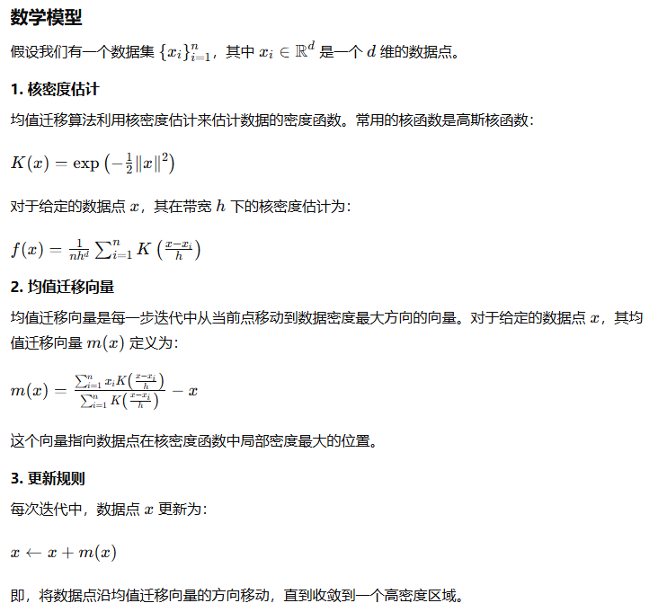
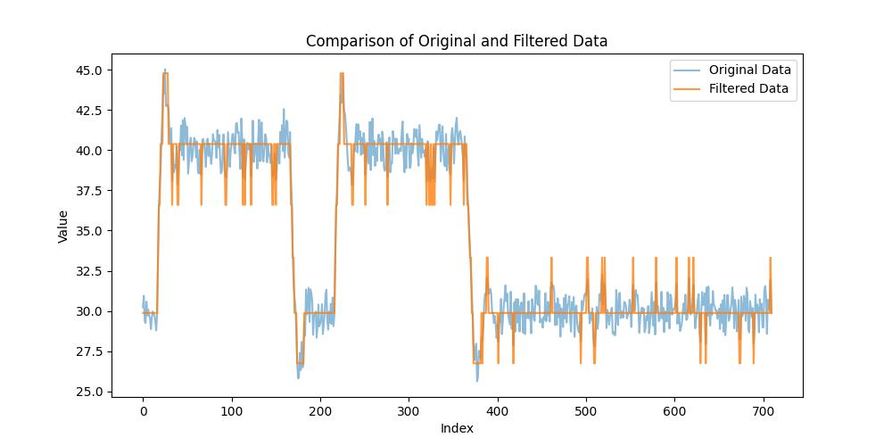

# 均值迁移滤波

均值迁移滤波（Mean Shift Filtering）是一种非参数的聚类算法，常用于图像数据平滑和噪声去除。基本思想是通过迭代地将数据点移动到局部密度最大的区域，实现数据点的聚类和平滑。

## 算法方法描述

图像均值迁移滤波算法流程：

1. 创建像素空间向量（即像素空间窗口半径"sp"）与颜色空间向量（即颜色空间窗口半径"sr"）(我们将图像放在了一个新的维度中，坐标由像素在空间的位置，以及像素强度值组成)
2. 选择一个像素点作为起始点
3. 计算该点附近的“均值”，并标记该“均值”所在像素空间的位置
4. 选取该标记点，作为当前选取的点
5. 重复过程3-4，直到满足一定的迭代次数和限制条件
6. 将起始点的像素强度值（灰度值）更新为终止点的像素强度值

均值迁移滤波的终止条件：

1. 迭代次数达到最大值：设置一个最大迭代次数，当迭代次数达到该值时，终止滤波。
2. 像素值变化小于阈值：设置一个阈值，当像素值的更新幅度小于该阈值时，终止滤波。
3. 均值向量与中心点距离小于阈值：设置一个阈值，当均值向量与中心点的距离小于该阈值时，终止滤波。

OpenCV 提供了均值迁移滤波 pyrMeanShiftFiltering() 函数,下面简单解释一下该函数。
void pyrMeanShiftFiltering( InputArray src, OutputArray dst,
                                    double sp, double sr, int maxLevel = 1,
                                    TermCriteria termcrit=TermCriteria(TermCriteria::MAX_ITER+TermCriteria::EPS,5,1) );
src：使用的图像，可以是三通道（彩色图像）或单通道（灰度图像）
dst：输出图像，如果未提供，函数将创建并返回一个新的图像
sp: 像素空间窗口半径，值越大，细节丢失越多，结果更平滑
sr: 颜色空间窗口半径，代表选择颜色值的范围，较大的值会导致更多的颜色合并，从而平滑颜色变化。
maxLevel: 金字塔最大层数。
termcrit: 迭代终止条件

CSV列数据均值迁移滤波算法描述：

1. 使用pandas库读取CSV文件，提取需要进行滤波的列数据。
2. 将提取的列数据转换为适合均值迁移算法处理的格式（通常是二维数组）。
3. 均值迁移滤波：
    + 初始化均值迁移滤波器，并设置带宽参数（bandwidth），该参数决定搜索窗口的半径。
    + 对数据进行迭代处理：
      + 对于每个数据点，计算其在指定带宽范围内的邻域点。
      + 计算这些邻域点的均值。
      + 将数据点移动到该均值位置。
      + 重复上述过程，直到所有数据点的移动量小于预设的阈值或达到最大迭代次数。
    + 记录每个数据点所属的簇标签和每个簇的中心点。

## 算法复杂度描述

每个数据点需要计算其他所有数据点的距离，以确定其邻域点。这一过程的复杂度为O(n*2×d)，因为需要对每个数据点进行n次距离计算。
所以时间复杂度为：
O(T×n*2×d)
n 是数据点的数量。
T 是迭代次数。
d 是数据的维度（在处理单列数据时，d = 1）。

## 输出结果

## 优点

1. 非参数性质：
    + 不需要预先假设数据的分布形式或簇的数量。
    + 只需一个带宽参数，可以自动确定簇的数量。
2. 平滑效果好：
    + 对数据进行平滑处理时，可以有效去除噪声，保留数据的主要结构。
3. 适用于多种数据类型：
    + 可以应用于一维、二维以及高维数据，广泛用于图像处理、模式识别等领域。
4. 鲁棒性强：
    + 对异常值不敏感，因为异常值通常不会形成高密度区域，不会影响簇的中心位置。

## 缺点

1. 计算复杂度高：
    + 时间复杂度较高，尤其是对于大数据集或高维数据，计算成本显著。
    + 每次迭代需要计算所有点之间的距离，邻域搜索耗时较长。
2. 依赖带宽参数：
    + 选择合适的带宽参数对算法效果至关重要，带宽过大或过小都会影响结果。
    + 需要经验或交叉验证来确定最优带宽参数。
    + 迭代次数难以预估：
3. 迭代次数取决于数据分布和带宽参数，可能需要较多迭代才能收敛。
    + 在某些情况下，收敛速度较慢。
4. 适用场景有限：
    + 对于簇形状不规则或簇内密度变化较大的数据集，效果可能不理想。
    + 对于非常高维的数据，均值迁移滤波的效果可能不如其他降维和聚类方法。
5. 内存占用高：
    + 需要存储所有点之间的距离和邻域信息，内存消耗较大，尤其是对于大规模数据集。

## 优化方向

1. 使用空间划分数据结构：如kd-tree或球树（Ball Tree），以加速邻域搜索
2. 选择合适的带宽：带宽参数对算法的收敛速度有重要影响，选择合适的带宽可以减少迭代次数。
3. 如果数据维度较高，可以先进行降维处理。

## 适用场景

1. 均值迁移滤波在图像处理和分割中具有广泛的应用
2. 均值迁移滤波适用于各种一维或多维数据的平滑和去噪。
3. 均值迁移滤波是一种强大的聚类工具，可以用于模式识别和聚类分析。
4. 在自然语言处理领域，均值迁移滤波可以用于文本聚类和主题建模。

## 总结

均值迁移滤波在处理中小规模数据集、进行噪声去除和平滑处理方面表现出色，尤其适用于图像处理和模式识别等领域。然而，其高计算复杂度和对带宽参数的敏感性限制了其在大规模数据和高维数据上的应用。针对这些问题，可以通过使用空间数据结构、降维处理和经验性带宽选择等方法进行优化。

## 参考文献

[1](https://blog.csdn.net/kingkee/article/details/94437333)
[2](https://waltpeter.github.io/open-cv-basic/image-filtering/index2.html)
[3](https://www.jianshu.com/p/d5a473c8af48)