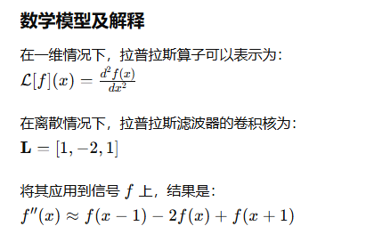
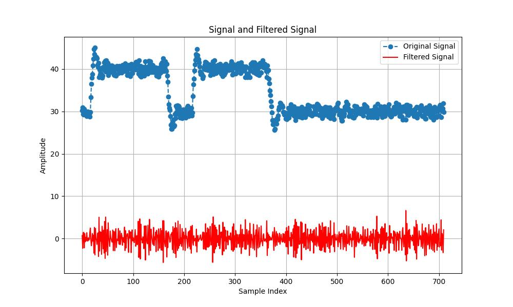
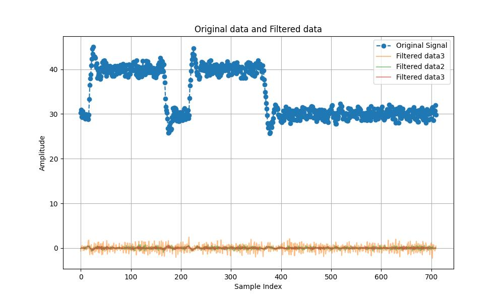

# 拉普拉斯滤波器

## 算法方法描述

拉普拉斯滤波器是一种边缘检测滤波器，基于二阶导数。其主要目的是通过计算图像或信号中的二阶导数来检测快速变化的区域（即边缘）。在一维信号处理中，拉普拉斯滤波器会突出信号中的突变点，在图像处理中，它能突出图像中的边缘。

## 算法复杂度描述

拉普拉斯滤波器的时间复杂度取决于信号或图像的大小，以及卷积操作的实现方式。在一般情况下，对于长度为 N 的一维信号，卷积操作的时间复杂度为 O(N)。

## 输出结果

## 优点

1. 边缘检测：拉普拉斯滤波器是高通滤波器，能够突出图像或信号中的快速变化区域，有助于边缘检测。
2. 简单快速：拉普拉斯滤波器的卷积操作相对简单，计算复杂度较低。

## 缺点

1. 对噪声敏感：拉普拉斯滤波器对噪声非常敏感，容易将噪声也检测为边缘。
2. 不适合平滑信号：由于拉普拉斯滤波器主要用于边缘检测，不适用于信号的平滑处理。
3. 局限性：只能检测变化和边缘，无法提供关于信号或图像结构的其他信息。

## 优化方向

1. 预处理和去噪：在应用拉普拉斯滤波器之前，先对信号进行预处理以去除噪声。

2. 结合其他滤波器：将拉普拉斯滤波器与其他滤波器（如Sobel、Canny）结合使用，以增强边缘检测效果。

3. 调整滤波器的权重：在计算拉普拉斯滤波器时，可以调整邻域像素的权重，以增强或减弱滤波效果。

4. 多尺度分析：通过不同尺度（如不同大小的窗口或不同分辨率）进行拉普拉斯滤波，以检测不同尺度下的边缘和细节。

## 适用场景

1. 图像处理：
    + 边缘检测：用于检测图像中的边缘和细节。
    + 特征提取：在图像处理中用于特征提取和形状检测。
2. 信号处理：
信号变化检测：用于检测一维信号中的突变点和不连续点。

## 总结

拉普拉斯滤波器能够准确定位信号中的变化点，计算简单高效，适合实时应用。但其对噪声敏感，容易放大信号中的高频噪声，不适用于信号平滑和降噪。
