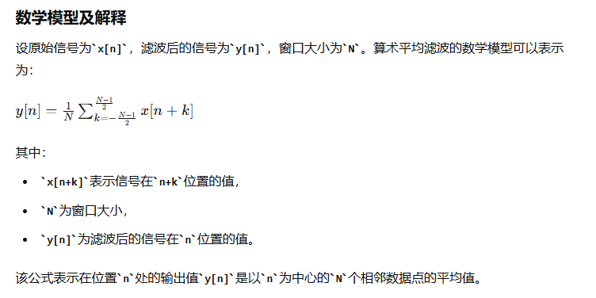
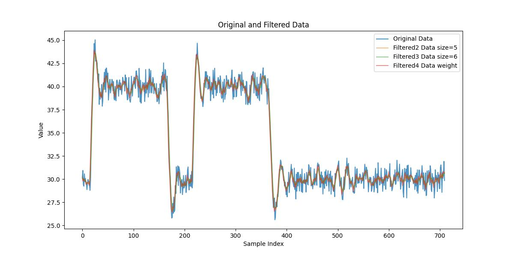
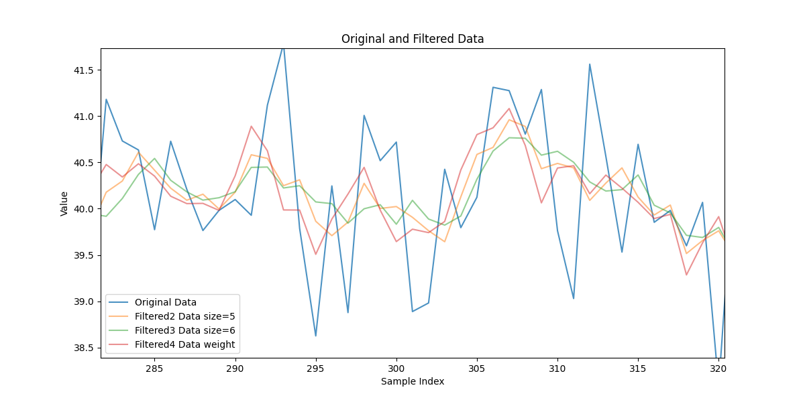

# 算术平均滤波法

## 算法方法描述

算术平均滤波法是一种常用的信号处理技术，主要用于去除数据中的噪声，实现信号的平滑。其基本思想是通过计算窗口内数据的算术平均值来替代中心点的值，从而达到平滑信号的效果。这种方法简单易实现，适用于处理含有随机噪声的信号。

算术平均滤波法的原理是通过对信号中的每个数据点，计算其周围一组数据点的平均值来平滑信号。具体步骤如下：

1. 确定窗口大小：选择一个窗口大小N，通常是奇数，以确保有一个明确的中心点。
2. 计算窗口内的平均值：对于信号中的每个数据点，取其前后(N-1)/2个数据点（包括自己在内）构成一个窗口，计算这个窗口内所有数据点的算术平均值。
3. 替代原始值：用计算得到的平均值替代窗口中心的数据点值。
4. 处理边界：在信号的起始和结束部分，由于窗口无法完整覆盖，可以使用较小的窗口或其他边界处理方法。

## 算法复杂度描述

假设信号长度为L，窗口大小为N，则算术平均滤波法的时间复杂度可以分为两个部分：

+ 计算每个窗口的平均值：对于每个数据点，计算其前后N个数据点的平均值需要进行N次加法和一次除法。因此，总的计算量为O(L * N)。
+ 边界处理：边界处理的时间复杂度通常较小，可以忽略不计。

总体来说，算术平均滤波法的时间复杂度为O(L * N)，其中L为信号长度，N为窗口大小。在实际应用中，窗口大小N通常远小于信号长度L，因此时间复杂度可以简化为O(L)。

## 输出结果

## 优点

1. 简单易实现：
算术平均滤波法的计算和实现非常简单，不需要复杂的数学运算和编程技巧，适合初学者和快速实现。

2. 计算效率高：
算术平均滤波法的时间复杂度为O(L * N)，其中L是信号长度，N是窗口大小。在实际应用中，窗口大小通常较小，因此计算效率较高。

3. 平滑效果明显：
对于含有高频随机噪声的信号，算术平均滤波法能够有效地平滑信号，减少噪声影响。

## 缺点

1. 边界效应：
在信号的边界处，由于窗口无法完整覆盖，算术平均滤波法可能会导致边界效应，影响滤波效果。

2. 信号细节损失：
算术平均滤波法对信号的所有部分一视同仁，因此在去除噪声的同时，也可能会平滑掉信号中的一些细节和突变。

3. 不适用于非高斯噪声：
算术平均滤波法假设噪声为高斯白噪声，对于非高斯噪声的处理效果较差，例如尖锐的脉冲噪声。

4. 窗口大小选择困难：
窗口大小的选择是一个权衡过程，过大会导致信号过度平滑，过小则无法有效去除噪声。

## 优化方向

1. 调整窗口大小：
    + 窗口大小是影响滤波效果的关键参数。较大的窗口会平滑更多的噪声，但可能会丢失信号细节；较小的窗口则可能无法有效去除噪声。可以尝试不同的窗口大小来找到最佳值。
1. 加权平均滤波：
    + 与简单的算术平均滤波不同，加权平均滤波会赋予离中心更近的数据点更高的权重。这可以在平滑信号的同时保留更多的信号细节。
1. 多次滤波：
    + 过对信号进行多次滤波，可以进一步平滑信号。然而，过多的滤波可能会导致信号失真，因此需要权衡。
1. 边界处理：
    + 算术平均滤波在处理边界数据点时，通常会使用较小的窗口。这可能会导致边界效应。可以通过不同的边界处理策略（如镜像填充、循环填充等）来改进边界滤波效果。
1. 非线性滤波器：
    + 非线性滤波器（如中值滤波器）在处理含有尖锐噪声的信号时表现更好。可以考虑结合不同类型的滤波器来改善滤波效果。

## 适用场景

1. 随机噪声平滑：
算术平均滤波法适用于含有随机高斯噪声的信号，可以有效地平滑信号，减少噪声影响。

2. 传感器数据处理：
传感器数据通常包含随机噪声，算术平均滤波法可以用于传感器数据的平滑处理，提高数据的准确性和稳定性。

3. 图像处理：
在图像处理领域，算术平均滤波法可以用于图像的平滑处理，减少图像中的高频噪声。

4. 预处理步骤：
在进行复杂信号处理之前，算术平均滤波法可以作为一种预处理步骤，初步平滑信号，减少噪声影响。

## 总结

算术平均滤波法是一种简单而常用的信号滤波方法。它通过连续取 N 个采样值进行算术平均运算，可以有效地平滑信号并减小噪声的影响。算术平均滤波法适用于对一般具有随机干扰的信号进行滤波，尤其适用于具有平均值且在一定范围内波动的信号。

特别需要注意的是，算术平均滤波法相对较简单，并且对快速变化和突变信号的响应较为迟缓。因此，在一些需要快速响应信号变化的应用中，可能不适合使用算术平均滤波法。

## 参考文献

[算术平均滤波法](https://blog.csdn.net/weixin_47225948/article/details/133125540)
[模拟量处理方式介绍（2）算术平均滤波法](https://jzgkchina.com/node/1869)
