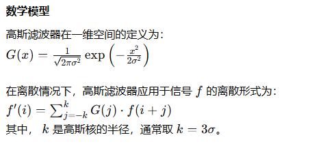
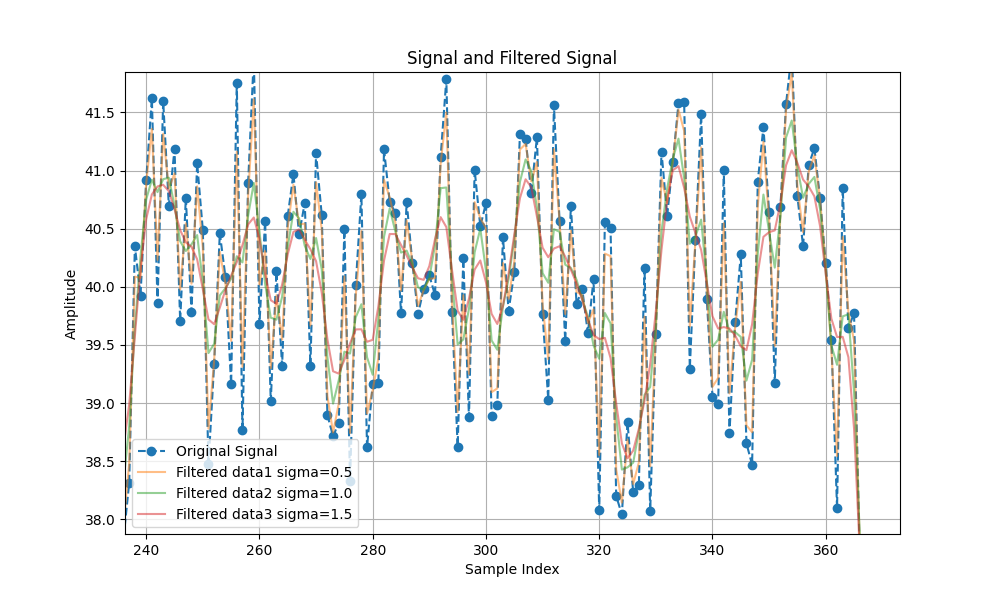

# 高斯滤波

## 算法方法描述

高斯滤波器是一种线性平滑滤波器，基于高斯函数的形状进行加权平均。其核心思想是通过高斯分布对信号中的每个点进行加权平均，权重由点到中心的距离和标准差（σ）决定。

1. 高斯核的计算：
    + 根据给定的标准差 σ，计算高斯核。
    + 核大小通常选择为 2k+1，即 2×3σ+1。
2. 边缘处理：
处理信号边缘时，可以使用填充（如镜像填充、零填充）策略来避免边缘效应。
3. 卷积运算：
使用高斯核对信号进行卷积运算，得到平滑后的信号。

## 算法复杂度描述

假设信号长度为 N，高斯核大小为 K，一维高斯滤波器的时间复杂度为 O(NK)。

## 输出结果

## 优点

1. 平滑效果好：高斯滤波器对信号或图像进行平滑处理，能够有效减少高频噪声。
2. 无振铃效应：高斯滤波器是无振铃滤波器，不会在信号的边缘产生振铃效应，这对于一些对边缘敏感的应用场景非常有用。
3. 数学性质良好：高斯函数在时域和频域都是良好定义的，其卷积运算具有平滑和低通滤波效果，且性质容易分析。
4. 可参数化调节：通过调整标准差 σ，可以灵活控制滤波器的平滑程度。

## 缺点

1. 模糊边缘：高斯滤波器会平滑整个信号或图像，包括边缘部分，可能导致边缘细节丢失和模糊化。
2. 计算复杂度较高：虽然一维高斯滤波的计算复杂度较低，但对于高维数据（如图像），其计算复杂度较高。
3. 无法保留细节：高斯滤波器是低通滤波器，无法同时保留高频细节和去除噪声。

## 优化方向

1. 选择合适的标准差 (sigma)：
不同的标准差会影响平滑效果和信号保留程度。较小的标准差会保留更多的原始信号特征，但可能不能很好地去除噪声；较大的标准差会更好地去除噪声，但可能会导致信号模糊。因此，需要根据实际应用选择合适的标准差。
1. 多尺度滤波：
使用多个不同标准差的高斯滤波器对信号进行多尺度滤波，然后结合不同尺度的滤波结果，可以更好地平衡去噪和信号保留。
1. 边缘处理：
在边缘处理时，可以使用不同的策略（如填充、裁剪等）来减少边缘效应的影响。
1. 快速算法：
对于大数据集，可以使用快速算法来提高计算效率。例如，使用快速傅里叶变换（FFT）来加速高斯滤波。

## 适用场景

1. 图像处理：
    + 去噪：用于去除图像中的高频噪声。
    + 预处理：在进一步的图像处理（如边缘检测、特征提取）之前进行平滑处理。
2. 信号处理：
    + 信号平滑：对一维信号进行平滑处理，去除高频噪声。
    + 特征提取：在信号分析中，用于平滑信号以提取主要趋势。
3. 计算机视觉：
    + 图像金字塔：用于生成图像金字塔的高斯平滑层次。
    + 边缘检测：作为Canny边缘检测等算法的预处理步骤。
4. 医学图像处理：
    + 去噪：在CT、MRI等医学成像中，用于去除噪声，提升图像质量。
    + 图像增强：用于增强图像对比度和细节。
